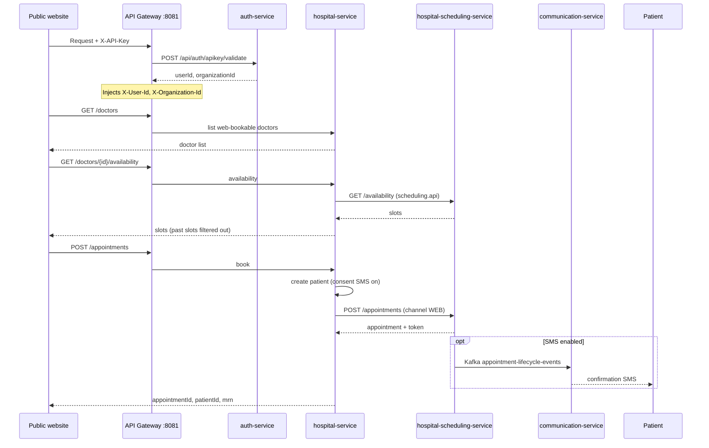

# Public Website Appointment Integration — Aurora HMS

This guide is for **external websites** (e.g. aurora.hospital) that book doctor appointments against Aurora HMS. It covers authentication, the three HTTP APIs, integration flow, payloads, errors, and operational prerequisites.

**Patient-facing sites do not use staff login or JWT.** Integrators authenticate with an **`X-API-Key`** issued by Aurora HMS.

---

## Overview

| Item | Value |
|------|--------|
| **Gateway base URL (local)** | `http://localhost:8081` |
| **API prefix** | `/api/public/web-booking` |
| **Backend service** | `hospital-service` (via API Gateway) |
| **External auth** | `X-API-Key` header (validated at API Gateway) |
| **Booking channel stored in HMS** | `WEB` |

The public site never talks to `hospital-scheduling-service` directly. The gateway validates your API key, then `hospital-service` validates the doctor, loads slots from scheduling, creates the patient, and books the appointment using the internal `scheduling.api` service account.

---

## Architecture



---

## Prerequisites (hospital admin / HMS setup)

Before integrating, ensure the following are configured in Aurora HMS:

1. **API key for your website** — A row in `users.api_keys` linked to the `scheduling.api` service account (see [Authentication](#authentication)). Hospital IT issues the raw key once; only the SHA-256 hash is stored.
2. **Doctor enabled for web booking** — `appointmentsFromWeb = true` and doctor is active.
3. **Doctor schedule** — `appointmentSlots` and `offDays` on the doctor profile (synced to scheduling as working hours and blackouts).
4. **Booking window** — `numberOfDaysCanAppointment` on the doctor (default **30** days ahead if unset).
5. **Services running** — API Gateway (`8081`), `auth-service`, `hospital-service`, `hospital-scheduling-service`, Eureka.
6. **Scheduling service account** — User `scheduling.api` with role `SCHEDULING_API` (`APPOINTMENT_VIEW`, `APPOINTMENT_BOOK`). Used server-side when booking; your API key maps to this account at the gateway.
7. **Optional SMS** — `comm.appointment.sms.enabled=true` on scheduling + communication stack; patient phone is taken from `primaryPhone` on book.

Doctors with `appointmentsFromWeb = false` or inactive are excluded from the doctor list and return `doctor_not_available_for_web_booking` if called directly.

---

## Authentication

External integrations use **API keys**, not staff JWTs.

### Required headers

| Header | Required | Description |
|--------|----------|-------------|
| `X-API-Key` | **Yes** (production) | Raw API key issued by Aurora HMS |
| `Content-Type` | Yes for `POST` | `application/json` |
| `Authorization` | No | Do not send staff JWT for these routes |

### How it works

1. Your website sends `X-API-Key: <raw-key>` on every request to the gateway.
2. **`ApiKeyAuthGlobalFilter`** (API Gateway) calls `auth-service` → `POST /api/auth/apikey/validate`.
3. On success, the gateway adds downstream headers:
   - `X-User-Id` — service account user (typically `scheduling.api`)
   - `X-Organization-Id` — organization tied to the key (e.g. Aurora / `ASHK`)
4. The request is routed to `hospital-service` at `/api/public/web-booking/**`.

`/api/public/web-booking/**` is on the gateway **JWT allowlist** (no staff login), but **API key validation still runs when the header is present**. Invalid or expired keys receive **HTTP 401** before reaching hospital-service.

### Key provisioning

| Item | Detail |
|------|--------|
| Storage | `users.api_keys` — only **SHA-256 hash** of the raw key is stored |
| Service account | `scheduling.api` — password login disabled; keys are the integration credential |
| Role | `SCHEDULING_API` — minimum permissions for appointment view/book |
| Organization | Key is scoped to an organization (e.g. Aurora `ASHK`) via `organization_id` on the key row |

**Production:** Request a dedicated key from hospital IT. Do not use seeded development keys in production.

**Local development (after DB migrations):** A dev key is seeded for Aurora:

| Name | Raw key (dev only) | Organization |
|------|-------------------|--------------|
| `Aurora Web Booking Dev Key` | `esk_test_scheduling_aurora_web_key` | `ASHK` |

Another default dev key exists for `DEMO_ORG`: `esk_test_scheduling_default_key_for_dev_only` (see `database-versioning/changelog/data/021-scheduling-api-service-account.sql`).

> **Note:** In some local setups the gateway JWT filter is disabled and requests **without** `X-API-Key` may still succeed. **Production integrators must always send a valid key.** Treat missing-key access as dev-only behaviour, not part of the contract.

### Security practices

- Store the raw key in server-side config or secrets manager — **never** embed in public front-end JavaScript.
- For a browser booking UI, call these APIs from **your backend** (BFF), or use a same-origin proxy that injects `X-API-Key`.
- Rotate keys by issuing a new row in `users.api_keys` and deactivating the old key (`is_active = false`).
- Use HTTPS in production.

### CORS

For browser apps on another origin, configure **CORS** on the API Gateway for your website origin. Prefer server-side proxying so the API key is not exposed to end users.

---

## Integration flow (what to do, in order)

### Step 1 — Load doctors

Call `GET /api/public/web-booking/doctors` on page load.

- Show `doctorName`, `speciality`, `departmentName`.
- Use `doctorId` (UUID) for later calls.
- Use `numberOfDaysCanAppointment` to limit the date picker (fallback: **30** days).

### Step 2 — Load slots for a date

When the user picks a doctor and date:

`GET /api/public/web-booking/doctors/{doctorId}/availability?fromDate={YYYY-MM-DD}&toDate={YYYY-MM-DD}`

- For a single day, set `fromDate` and `toDate` to the same value.
- If `blackedOut` is `true`, show “not available on this date”.
- Display only slots returned (past slots and zero-capacity slots are already removed server-side).
- Store exact `start` and `end` strings from the response for booking — do not reformat.

### Step 3 — Collect patient details

Required before submit:

| Field | Required | Notes |
|-------|----------|--------|
| `fullName` | Yes | Trimmed on server |
| `primaryPhone` | Yes | Used for patient record and SMS |
| `primaryEmail` | No | |
| `ageYears` | No | Defaults to **30** if omitted |

### Step 4 — Book

`POST /api/public/web-booking/appointments` with `doctorId`, patient fields, `appointmentDate`, and the **exact** `slotStart` / `slotEnd` from step 2.

On success, show `message`, `mrn`, and optionally `appointmentId`.

**Important:** Slots can be taken between step 2 and step 4. Handle `slot_no_longer_available` (HTTP 409) by refreshing availability and asking the user to pick again.

---

## API reference

### 1. List web-bookable doctors

```
GET /api/public/web-booking/doctors
```

**Response `200`:**

```json
[
  {
    "doctorId": "d0e8400-e29b-41d4-a716-446655440000",
    "doctorName": "Dr. Rahman",
    "doctorCode": "DR-001",
    "speciality": "Cardiology",
    "departmentName": "Cardiology",
    "numberOfDaysCanAppointment": 30
  }
]
```

| Field | Type | Description |
|-------|------|-------------|
| `doctorId` | UUID | Use in availability and book calls |
| `doctorName` | string | Display name |
| `doctorCode` | string | Optional hospital code |
| `speciality` | string | Optional |
| `departmentName` | string | Optional |
| `numberOfDaysCanAppointment` | int | Max days ahead patient can book |

---

### 2. Get available slots

```
GET /api/public/web-booking/doctors/{doctorId}/availability?fromDate={date}&toDate={date}
```

**Query parameters:**

| Param | Format | Required | Description |
|-------|--------|----------|-------------|
| `fromDate` | `YYYY-MM-DD` | Yes | Start of range (inclusive) |
| `toDate` | `YYYY-MM-DD` | Yes | End of range (inclusive); must be ≥ `fromDate` |

Both dates must fall within the doctor’s booking window (today through today + `numberOfDaysCanAppointment`).

**Response `200`:**

```json
[
  {
    "date": "2026-05-24",
    "blackedOut": false,
    "slots": [
      {
        "start": "2026-05-24T09:00:00+06:00",
        "end": "2026-05-24T09:15:00+06:00",
        "availableCount": 2
      },
      {
        "start": "2026-05-24T09:15:00+06:00",
        "end": "2026-05-24T09:30:00+06:00",
        "availableCount": 1
      }
    ]
  }
]
```

| Field | Type | Description |
|-------|------|-------------|
| `date` | string | `YYYY-MM-DD` |
| `blackedOut` | boolean | If `true`, doctor is off that day — no slots |
| `slots[].start` | string | ISO-8601 offset datetime — pass unchanged to book |
| `slots[].end` | string | ISO-8601 offset datetime |
| `slots[].availableCount` | int | Remaining capacity; only slots with count > 0 are returned |

**Notes:**

- Response is one object per day in the requested range.
- Slots in the past are filtered out server-side.
- Use the same `start`/`end` values in the book request; the server re-validates availability before confirming.

---

### 3. Book appointment

```
POST /api/public/web-booking/appointments
```

**Request body:**

```json
{
  "doctorId": "d0e8400-e29b-41d4-a716-446655440000",
  "fullName": "Jane Patient",
  "primaryPhone": "01798765432",
  "primaryEmail": "jane@example.com",
  "ageYears": 35,
  "appointmentDate": "2026-05-24",
  "slotStart": "2026-05-24T09:00:00+06:00",
  "slotEnd": "2026-05-24T09:15:00+06:00"
}
```

| Field | Type | Required | Description |
|-------|------|----------|-------------|
| `doctorId` | UUID | Yes | From doctor list |
| `fullName` | string | Yes | Patient name |
| `primaryPhone` | string | Yes | Mobile; SMS target if enabled |
| `primaryEmail` | string | No | |
| `ageYears` | int | No | Default `30` |
| `appointmentDate` | string | Yes | `YYYY-MM-DD`; must match calendar date of `slotStart` |
| `slotStart` | string | Yes | ISO-8601 offset datetime from availability |
| `slotEnd` | string | Yes | ISO-8601 offset datetime from availability |

**Response `201`:**

```json
{
  "appointmentId": "aa0e8400-e29b-41d4-a716-446655440010",
  "patientId": "550e8400-e29b-41d4-a716-446655440000",
  "mrn": "MRN-2026-001234",
  "message": "Appointment request submitted successfully."
}
```

| Field | Type | Description |
|-------|------|-------------|
| `appointmentId` | UUID | Created appointment in scheduling |
| `patientId` | UUID | Patient record in hospital-service |
| `mrn` | string | Medical record number |
| `message` | string | User-facing success text |

**Server-side actions on success:**

1. Validates doctor is active and web-bookable.
2. Validates slot is in the future and within booking window.
3. Re-checks slot is still available (`availableCount > 0`).
4. Creates a new patient record with `consentTextMessaging: true`.
5. Books via scheduling with `appointmentType: "NEW"`, `bookingChannel: "WEB"`, and doctor’s `serialStartFrom` for queue token.
6. May send confirmation SMS if communication stack is enabled.

> **Known limitation — patient deduplication:** A new patient record (and MRN) is created on every booking regardless of whether the phone number already exists. If the same person books more than once via the website, they will accumulate separate patient records in HMS. Hospital staff should merge duplicate records via the patient management UI when the patient arrives. A find-or-create-by-phone flow is planned but not yet implemented.

---

## Error handling

Errors use Spring’s default body; the **reason phrase / message** is a machine-readable **code** string. Map these in your UI:

| HTTP | Code | When | Suggested user message |
|------|------|------|------------------------|
| 401 | (gateway) | Missing/invalid/inactive/expired `X-API-Key` | Unable to authenticate; contact hospital IT |
| 400 | `invalid_date_range` | `fromDate` > `toDate` | End date must be on or after start date |
| 400 | `doctor_not_available_for_web_booking` | Doctor inactive or web booking off | This doctor is not available for online booking |
| 400 | `invalid_appointment_date` | Bad date format | Choose a valid appointment date |
| 400 | `appointment_date_in_past` | Date before today | Date cannot be in the past |
| 400 | `appointment_date_outside_booking_window` | Beyond allowed days | Date is outside the booking window |
| 400 | `slot_date_mismatch` | `appointmentDate` ≠ date of `slotStart` | Slot does not match selected date |
| 400 | `invalid_slot_start` / `invalid_slot_end` | Unparseable datetime | Invalid time slot |
| 400 | `invalid_slot_range` | `slotEnd` not after `slotStart` | Invalid time range |
| 400 | `slot_in_past` | Slot already started | Slot has passed; choose another |
| 404 | `doctor_not_found` | Unknown `doctorId` | Doctor not found |
| 409 | `slot_no_longer_available` | Slot taken or full | Slot no longer available; pick another |
| 409 | `appointment_booking_failed` | Scheduling rejected book | Could not complete booking; try again or call hospital |
| 503 | `scheduling_unavailable` | Scheduling service down | Scheduling temporarily unavailable |

**Example error response:**

```json
{
  "timestamp": "2026-05-24T08:00:00.000+00:00",
  "status": 409,
  "error": "Conflict",
  "message": "slot_no_longer_available",
  "path": "/api/public/web-booking/appointments"
}
```

Read `message` (or `error` in some clients) as the code key.

---

## Date and time rules

| Rule | Detail |
|------|--------|
| Date format | `YYYY-MM-DD` (e.g. `2026-05-24`) |
| Slot format | ISO-8601 **with offset** (e.g. `2026-05-24T09:00:00+06:00`) |
| Timezone | Use offset that matches hospital local time; server compares instants |
| Booking window | Today through today + `numberOfDaysCanAppointment` (per doctor) |
| Slot selection | Always use `start`/`end` from availability response verbatim |
| Race conditions | Refresh slots after `slot_no_longer_available` |

---

## SMS confirmation (optional)

After a successful book, scheduling may publish an event to Kafka (`appointment-lifecycle-events`). The communication service sends an SMS using template `appointment.lifecycle` when:

- `comm.appointment.sms.enabled=true` (scheduling), and  
- communication Kafka consumer is enabled, and  
- `primaryPhone` was provided.

The patient does not need to call a separate API for SMS; it is automatic when configured.

---

## Environment configuration (operators)

| Variable | Default | Purpose |
|----------|---------|---------|
| `HOSPITAL_WEB_BOOKING_ORGANIZATION_ID` | `a1b2c3d4-e5f6-4789-a012-a1b2c3d4e5f6` | Organization for new patients |
| `HOSPITAL_WEB_BOOKING_SCHEDULING_USER_ID` | (empty → `scheduling.api` user) | Service account for scheduling calls |

Configured in `hospital-service` `application.yml` under `hospital.web-booking`.

---

## Example: JavaScript (fetch)

Call from a **server-side** route or BFF so the API key is not exposed in the browser.

```javascript
const BASE = 'https://api.aurora.hospital'; // or http://localhost:8081
const API_KEY = process.env.AURORA_WEB_BOOKING_API_KEY; // server env only

const headers = {
  'X-API-Key': API_KEY,
  'Content-Type': 'application/json',
};

// 1. Doctors
const doctors = await fetch(`${BASE}/api/public/web-booking/doctors`, { headers }).then((r) => r.json());

const doctorId = doctors[0].doctorId;
const date = '2026-05-24';

// 2. Availability
const availability = await fetch(
  `${BASE}/api/public/web-booking/doctors/${doctorId}/availability?fromDate=${date}&toDate=${date}`,
  { headers }
).then((r) => r.json());

const slot = availability[0]?.slots?.[0];
if (!slot) throw new Error('No slots');

// 3. Book
const bookRes = await fetch(`${BASE}/api/public/web-booking/appointments`, {
  method: 'POST',
  headers,
  body: JSON.stringify({
    doctorId,
    fullName: 'Jane Patient',
    primaryPhone: '01798765432',
    primaryEmail: 'jane@example.com',
    ageYears: 35,
    appointmentDate: date,
    slotStart: slot.start,
    slotEnd: slot.end,
  }),
});

if (!bookRes.ok) {
  const err = await bookRes.json();
  throw new Error(err.message || 'booking_failed');
}

const confirmation = await bookRes.json();
console.log(confirmation.mrn, confirmation.appointmentId);
```

---

## Example: cURL

```bash
BASE="http://localhost:8081"
API_KEY="esk_test_scheduling_aurora_web_key"   # dev only — use production key from IT

# List doctors
curl -s -H "X-API-Key: $API_KEY" "$BASE/api/public/web-booking/doctors" | jq .

DOCTOR_ID="<doctor-uuid>"
DATE="2026-05-24"

# Availability
curl -s -H "X-API-Key: $API_KEY" \
  "$BASE/api/public/web-booking/doctors/$DOCTOR_ID/availability?fromDate=$DATE&toDate=$DATE" | jq .

# Book (use exact start/end from availability)
curl -s -X POST "$BASE/api/public/web-booking/appointments" \
  -H "X-API-Key: $API_KEY" \
  -H "Content-Type: application/json" \
  -d '{
    "doctorId": "'"$DOCTOR_ID"'",
    "fullName": "Jane Patient",
    "primaryPhone": "01798765432",
    "appointmentDate": "'"$DATE"'",
    "slotStart": "2026-05-24T09:00:00+06:00",
    "slotEnd": "2026-05-24T09:15:00+06:00"
  }' | jq .
```

---

## Reference implementation in this repo

| Asset | Path |
|-------|------|
| Public booking page | `frontend/src/pages/public/WebAppointmentBooking.tsx` |
| Route | `/book-appointment` (see `frontend/src/App.tsx`) |
| API client | `frontend/src/services/webBookingService.ts` |
| Error messages | `frontend/src/utils/webBookingErrors.ts` |
| Controller | `services/hospital-service/.../controller/WebBookingController.java` |
| Business logic | `services/hospital-service/.../service/WebBookingService.java` |
| Gateway API key filter | `services/api-gateway/.../filter/ApiKeyAuthGlobalFilter.java` |
| Key validation | `services/auth-service/.../controller/ApiKeyController.java` |
| Dev key seed (Aurora) | `services/hospital-service/.../changesets/138-aurora-scheduling-api-org-link.sql` |

The built-in `/book-appointment` page follows the same three-step flow but **does not send `X-API-Key` today** (works in local dev when the gateway does not enforce keys). **External production sites must send `X-API-Key` on every call** as documented above.

---

## Quick reference

| Step | Method | Path |
|------|--------|------|
| 1 | `GET` | `/api/public/web-booking/doctors` |
| 2 | `GET` | `/api/public/web-booking/doctors/{doctorId}/availability?fromDate=&toDate=` |
| 3 | `POST` | `/api/public/web-booking/appointments` |

**Auth:** `X-API-Key` on all requests · **Content-Type:** `application/json` for POST · **Success book:** HTTP `201` · **Invalid key:** HTTP `401`
