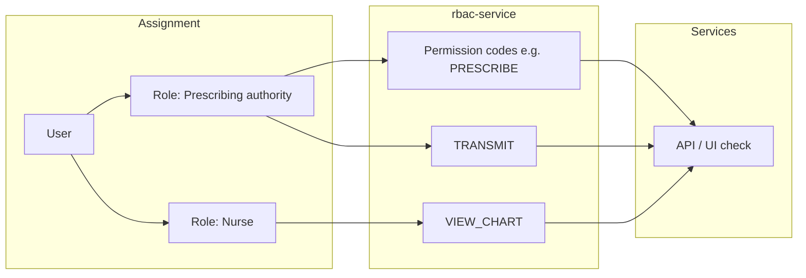

# RBAC Reorganization & Prescribing Authority — Requirements

**Status**: Draft (for design review)  
**Last updated**: 2026-04-01  
**Scope**: **EasyOps ERP — all modules and microservices** (not limited to hospital). Hospital prescribing is one **regulated example** under the same global rules.

**Related areas**: `rbac-service`, `api-gateway`, **all domain services** (accounting, AR/AP, sales, inventory, purchase, HR, CRM, manufacturing, pharma, hospital-*, platform services), frontend (`AuthContext`, navigation, every protected screen)

**Audience**: Product owners, security/architecture reviewers, and engineers implementing or auditing RBAC.

---

## 1. Purpose

### 1.1 Executive summary

- **Every** user-visible **function** must map to a **permission row** in **`rbac.permissions`** (and enforcement in code); **roles** bundle permissions—**prescribing authority** is a **role**, not a magic flag.
- **Create** (DB/Liquibase or admin) and **validate** (review, CI, audits) whenever behavior ships; **no** global embedded permission enums in app source.
- Enforcement is **deny by default**: APIs return **403** when the resolved user lacks the required permission; UI hides or disables actions and shows a clear message.
- Implementation is **phased**: pilot pattern → roll out by domain → remove UI/security bypasses → optional clinical provider registry on top of RBAC.
- This doc is **requirements**, not an implementation spec; service-specific designs reference this document.

### 1.2 Glossary

| Term | Meaning |
|------|---------|
| **Permission** | Atomic grant identified by stable **`code`** (and `resource` + `action` in `rbac-service`). What code checks (after resolving the user’s effective set). |
| **Role** | Named bundle of permissions; **assigned to users** per organization. *Prescribing authority* = a role whose permission set includes prescription codes. |
| **Effective permissions** | Union of permissions from all roles assigned to the user in the current **organization** context. |
| **Permission registry** | **PostgreSQL `rbac.permissions`** is authoritative; module-specific rows come from **that module’s service** Liquibase (e.g. `hospital-service`, `pharma-service`). |
| **Function** | One user-meaningful operation (e.g. one API mutation + matching UI action)—maps to **one primary permission** (see §2.1). |
| **Primary permission** | The main required code for that function; some endpoints may **alternatively** accept one of several codes (document as OR in the catalog row). |

This document defines **what we should do** to:

1. **Reorganize RBAC** so that **every user-facing function** maps to an explicit **permission row** in **`rbac.permissions`** (see **§2**). That includes **accounting, sales, inventory, purchase, HR, CRM, manufacturing, pharma, hospital**, … **Hospital** permissions exist in DB **only** when the hospital module is deployed (e.g. optional Liquibase context).
2. **Create and validate permissions** as first-class steps: every new operation **creates** a DB row (and **validates** enforcement matches it)—see **§2.6** and **§8**.
3. Apply a **prescribing authority** model (hospital/EHR): **prescribing authority is expressed as a role** (e.g. `PRESCRIBER` or `PRESCRIBING_AUTHORITY`) that **grants** the relevant **prescription permissions** via normal role–permission assignment in `rbac-service`. Enforcement still checks **permission codes** (users inherit them through the role). **Creating, signing, transmitting, or cancelling prescriptions** requires those permissions—**403** and clear UI denial if missing—**illustrating** regulated workflows inside the **same** global RBAC model.

---

## 2. Universal requirement — every function needs a permission

**Policy**: For **all** product surfaces we ship—**each distinct function** **must** have **exactly one primary permission** (a row in **`rbac.permissions`**: `code` + `resource` + `action`). No user-visible capability may rely solely on “being logged in” or a coarse role string outside RBAC. **Hospital-only** permissions are **not** inserted unless the hospital module is enabled (e.g. optional migration context).

### 2.1 What counts as a “function”

| Layer | What to cover |
|--------|----------------|
| **Backend** | Each **state-changing** HTTP handler (POST/PUT/PATCH/DELETE) and each **sensitive GET** (PHI, exports, admin diagnostics) declares **one required permission** checked before business logic. |
| **Frontend** | Each **route** that shows protected data and each **primary control** (toolbar button, row action, dialog submit) that triggers that behavior uses the **same permission code** as the API (via `hasPermission` / shared constant). |
| **Navigation** | Each menu entry or module entry maps to at least the **minimum permission** needed to land on that screen; stricter actions may need additional permissions on the page. |

**Granularity rule**: One permission represents **one user-meaningful operation** (e.g. “create patient”, “approve invoice”, “transmit prescription”). Avoid one mega-permission per page unless the page truly exposes only one operation.

### 2.2 Exceptions (minimal)

The following **do not** require a business permission row (they use authentication/session only):

- **Authentication** (login, logout, token refresh, password reset flows as defined by `auth-service`).
- **Static assets**, health checks, and **public** documentation endpoints.
- **Organization/workspace switcher** — may be gated by “any authenticated user” until a dedicated `workspace.select` permission is introduced.

Everything else in **EasyOps ERP** modules falls under **2.1**.

### 2.3 Enforcement expectations

- **Deny by default**: If a function has no permission assigned in code reviews, it is **not mergeable** until the catalog row exists and the check is wired (backend **and** UI where applicable)—**for any service**, not only clinical.
- **Same code, two places**: The **permission `code`** stored in `rbac-service` is the same string referenced in **gateway/service** and **`hasPermission('CODE')`** (or resource+action pair derived from that row).
- **No duplicate semantics**: Two different buttons must not share one permission if their **risk or policy** differs; split permissions instead.
- **OR semantics**: If a function may be allowed by **any of** several permissions (e.g. `…_MANAGE` **or** `…_APPROVE`), document that explicitly in the catalog row; implementation checks **any match**—still **one catalog row per permission code**, not one row per OR expression.

### 2.4 System-wide coverage

| Domain (examples) | Must define permissions for |
|-------------------|------------------------------|
| Platform | Users, roles, permissions, organizations, audit logs, notifications |
| Accounting / AR / AP / Bank | Journals, invoices, payments, reconciliations, reports |
| Sales / Inventory / Purchase | Orders, receipts, stock moves, PO approvals |
| HR / CRM / Manufacturing / Pharma | As per each module’s operations |
| Hospital & clinical services | Patients, encounters, prescriptions, pharmacy, billing, scheduling, … |

**Migration stance**: Existing legacy endpoints without checks are **debt**; any **touched** or **new** code in a release must either add the permission or be tracked in a **coverage backlog** with owner and target quarter.

### 2.5 Relationship to prescribing (§7)

Prescribing is a **subset** of this rule: prescription-related **functions** (draft, validate, transmit, cancel, …) each get their own **permission** catalog entries per §7. **Prescribing authority** is not a separate security primitive: it is a **role** whose members receive those permissions (see **§4.2** and **§6.4**).

### 2.6 Create and validate permissions (all operations)

**Create** (authoring a permission):

1. Add a row to the **permission catalog** (`code`, `resource`, `action`, description, owning service).
2. Register the same definition in **`rbac-service`** (via migration, seed, or admin UI—policy TBD) so roles can be assigned.
3. Reference the **`code`** from **backend** checks and **frontend** `hasPermission` / constants—**every** service that adds an API follows this, not only hospital.

**Validate** (proving the permission is real and enforced):

1. **PR review**: Checklist confirms catalog + code reference + role assignment plan.
2. **Automated (target)**: Lint or tests assert that annotated controllers / route tables only use **codes present in the catalog**; optional contract tests: “caller without permission → 403”.
3. **Periodic audit**: Compare catalog to production `rbac.permissions` and to **inventory of endpoints** per service; close gaps.

Without both **create** and **validate**, permissions drift and **security claims are not trustworthy**—applies **system-wide**.

---

## 3. Current gaps (baseline)

| Area | Issue |
|------|--------|
| **Coarse actions** | UI defaults (`Permissions.tsx`) use generic actions (`view`, `manage`, `create`, …). Many screens infer access from `resource + view` only—**across modules**, not only hospital. |
| **Service security** | Multiple microservices use **permit-all** HTTP security with RBAC **not** wired on endpoints; risk applies to **accounting, inventory, sales**, etc., equally until addressed. |
| **Hospital visibility** | `MainLayout` may show hospital menu items **without** a successful RBAC match (`skipRbacForVisibility` for `hospital`)—**one example** of bypass; similar patterns elsewhere must be eliminated. |
| **Prescriptions (example)** | Prescriber identity is **data** on the prescription; **no** permission distinguishes “can prescribe” vs “can view chart”—illustrates missing **function-level** permission on one domain. |
| **No create/validate pipeline** | Permissions are not consistently **created** in a catalog at feature time, nor **validated** by automation or audit—so coverage is unknown **ERP-wide**. |
| **Discoverability** | There is no **single catalog** listing **all** operations ↔ permissions for every service. |

---

## 4. Goals

### 4.1 RBAC reorganization

- **G0 — Universal mapping**: **Every function in every module** (§2) has a catalog permission; gaps are tracked to zero per release train for **touched** code, with a **roadmap** to full ERP coverage.
- **G0a — Create permissions**: New or changed operations **always** add their permission row (catalog + `rbac-service`) before merge, **all** domains.
- **G0b — Validate permissions**: CI, review, and periodic audits confirm catalog ↔ code ↔ database alignment (**§2.6**, **§8**).
- **G1 — Permission registry**: **`rbac.permissions`** holds every permission; optional **Liquibase** seeds per module with **contexts** for optional deployments.
- **G2 — Operation mapping**: For each **HTTP operation** (method + path pattern) that must be authorized, document **one primary permission** (some endpoints may accept multiple roles via multiple permissions on a role).
- **G3 — Naming convention**: Adopt a predictable **resource** taxonomy (domain modules) and **action** taxonomy (see §6). Avoid overloading `view` for destructive or regulated actions.
- **G4 — No silent bypass**: Remove or replace **broad UI bypasses** (e.g. unconditional hospital visibility) with **explicit** permissions or a documented **bootstrap** policy for dev/demo only.
- **G5 — Frontend alignment**: Navigation items, buttons, and routes use **`hasPermission` / resource checks** aligned with **`rbac.permissions.code`**—not ad hoc checks.

### 4.2 Prescribing authority (role + permissions)

**Model**: Follow standard **RBAC**: **permissions** are atomic; **roles** bundle permissions. **Prescribing authority** is implemented as **one or more roles** (e.g. role code `PRESCRIBING_AUTHORITY`, `LICENSED_PRESCRIBER`, or locale-specific naming) that are **assigned** the prescription-related **permissions**. Users gain the ability to prescribe by **being granted that role** (per organization), not by a hard-coded flag outside `rbac-service`.

| Layer | Responsibility |
|--------|----------------|
| **Permissions** | Fine-grained catalog codes: e.g. `HOSPITAL_PRESCRIPTION_PRESCRIBE`, `HOSPITAL_PRESCRIPTION_TRANSMIT`, `HOSPITAL_PRESCRIPTION_VIEW` (see §6–§7). APIs and UI check these **codes** after resolving the user’s effective permissions (union of permissions from all assigned roles). |
| **Role (“prescribing authority”)** | A role record in `rbac-service` linked to the **prescription permission** rows. Optionally split roles (e.g. **prescribe draft** vs **transmit only**) by assigning different permission subsets to different roles. |
| **User** | Assigned one or more roles; inherits permissions. No separate “is prescriber” field required for authorization if RBAC is complete (optional provider registry remains a **supplement** in **P5**). |

- **P1 — Permissions**: Define prescription **permissions** in the catalog (resource/action or stable `code`)—see §6 and matrix §7.
- **P2 — Role**: Define at least one **role** intended as prescribing authority; **attach** the prescribe/transmit/view (etc.) permissions to that role. Seed or document default role templates per deployment.
- **P3 — API enforcement**: Prescription endpoints require the same **permission codes** as today’s design; authorization resolves whether the user’s roles include those permissions. Read-only access may use only `…_VIEW` on a role without prescribe/transmit.
- **P4 — UX**: If the user lacks the effective permission, show **“You are not authorized to prescribe”** (or equivalent); can also hint **“Ask your administrator to assign the prescribing role”** when appropriate.
- **P5 — Provider linkage (optional phase 2)**: In addition to RBAC, optionally require `X-User-Id` to map to a **provider/doctor** with **active** prescribing status—**policy layer** on top of role+permission, not a replacement for it.

### 4.3 Conceptual model (users, roles, permissions)

Authorization follows **RBAC**: users are not given permissions directly in the baseline model; they receive **roles**, and **effective permissions** are derived for enforcement.

- **SYSTEM_ADMIN** (or equivalent): If used, document whether it **bypasses** permission checks or only receives a **wildcard role**; avoid undocumented superuser paths in production.

---

## 5. Recommendations (what we should do)

1. **Treat RBAC as a product deliverable**: Any new endpoint or sensitive button in **any service** ships with **catalog entry + create/validate steps + role assignment plan** (even if default roles are broad initially).
2. **Phase the work** (ERP-wide, not hospital-first only):
   - **Phase A**: **Liquibase/admin** conventions for `rbac.permissions`, optional **module contexts**, **rbac-service** alignment, **one** pilot module end-to-end to prove create/validate.
   - **Phase B**: Roll **create + validate** pattern to **all** remaining microservices and frontend modules by domain priority (financial, PHI, admin).
   - **Phase C**: Remove menu/UI bypasses (e.g. hospital `skipRbacForVisibility`) and any **permit-all** defaults in favor of explicit checks.
   - **Phase D (optional)**: Provider registry rules for **prescribing** only (DEA, local license)—subset of clinical.
3. **Database as source of truth**: Permission definitions live in **`rbac.permissions`** (seeded via Liquibase and/or admin UI). Application code references **string codes** that match the DB; **do not** maintain parallel enums or global `constants/permissions.ts` lists for module-specific permissions. Optional modules (e.g. hospital) use **optional Liquibase contexts** so their permission rows are not inserted when the module is not deployed.
4. **Audit**: Log denied attempts (user, org, permission, route) at gateway or service for **all** protected operations where compliance matters.

Detailed **implementation plans** (phases, tasks, exit criteria, waves) are in **§16**.

---

## 6. Proposed permission model

### 6.1 Resource taxonomy (illustrative — entire ERP)

Keep **lowercase, dot-separated** where needed. **Every product module** gets at least one resource (split further as needed):

| Resource (examples) | Scope |
|---------------------|--------|
| `accounting`, `ar`, `ap`, `bank` | Financial operations |
| `sales`, `inventory`, `purchase` | Commercial and supply chain |
| `hr`, `crm`, `manufacturing`, `pharma` | Domain modules |
| `hospital`, `hospital.prescription`, `hospital.pharmacy`, … | Clinical and hospital satellite services |
| `system`, `audit`, `notifications`, `organizations` | Platform |

*Hospital* rows are **examples** alongside **`inventory.stock.adjust`** or **`accounting.journal.post`**—same RBAC discipline.

### 6.2 Action taxonomy

| Action | Typical use |
|--------|-------------|
| `view` | Read-only UI and GET APIs that list/detail non-sensitive aggregates |
| `read` | Explicit read of sensitive entities (sometimes same as `view`) |
| `create` | Create new entity |
| `update` | Modify existing |
| `delete` | Remove / soft-delete |
| `prescribe` | **Regulated**: create/sign prescription workflow (could map to create+update on prescription only) |
| `transmit` | E-prescribe / transmit to pharmacy (may be separate from `prescribe`) |
| `dispense` | Pharmacy fulfillment |
| `admin` | Break-glass / configuration |

*Rule*: **Every new operation** gets either a **new action** under an existing resource or a **new resource**—and one row in the catalog.

### 6.3 Permission code format

Stable machine codes, e.g.:

- `HOSPITAL_PRESCRIPTION_VIEW`
- `HOSPITAL_PRESCRIPTION_PRESCRIBE`
- `HOSPITAL_PRESCRIPTION_TRANSMIT`
- `HOSPITAL_PHARMACY_DISPENSE`

These map 1:1 to `permissions.code` in `rbac-service` and to checks in code.

### 6.4 Prescribing authority as a role

- **Do not** implement “prescribing authority” as a bespoke boolean outside RBAC.
- **Do** create a **role** (e.g. `PRESCRIBING_AUTHORITY`) and assign permissions such as `HOSPITAL_PRESCRIPTION_PRESCRIBE`, `HOSPITAL_PRESCRIPTION_TRANSMIT`, and as needed `HOSPITAL_PRESCRIPTION_VIEW`.
- **Optional**: multiple roles (e.g. **resident prescriber** vs **attending**) by assigning **different sets** of the same permission pool.
- **Runtime**: Services continue to ask “does this user have permission **code** X?”—`rbac-service` answers **yes** if any of the user’s roles includes **X**.

---

## 7. Prescribing — operation matrix (finalized for Phase 4)

| Operation (conceptual) | HTTP (illustrative) | Permission(s) |
|------------------------|---------------------|---------------|
| List/get prescriptions (read) | `GET /api/prescriptions/...` | `HOSPITAL_PRESCRIPTION_VIEW` (or legacy coarse `hospital` view/manage via `RbacPermissionService`) |
| Create draft prescription | `POST /api/prescriptions` | `HOSPITAL_PRESCRIPTION_PRESCRIBE` |
| Update draft | `PUT/PATCH ...` | `HOSPITAL_PRESCRIPTION_PRESCRIBE` |
| Validate | `POST .../validate` | `HOSPITAL_PRESCRIPTION_PRESCRIBE` |
| Transmit | `POST .../transmit` | `HOSPITAL_PRESCRIPTION_TRANSMIT` (separate from prescribe; `HOSPITAL_MANAGE` still allows both) |
| Cancel | `POST .../cancel` | `HOSPITAL_PRESCRIPTION_PRESCRIBE` (same as draft workflow; no separate `CANCEL` code unless policy changes) |

*Role mapping*: The **prescribing authority** role (`PRESCRIBING_AUTHORITY`) includes `HOSPITAL_VIEW` (hospital nav and hospital-pharmacy catalog reads) plus prescription view + prescribe + transmit (`037-prescribing-authority-hospital-view.sql` adds `HOSPITAL_VIEW` to the role seeded in `035`). **Variants** (Liquibase `036-phase4-clinical-roles.sql`): **`PHARMACIST_DISPENSER`** — dispense + view Rx + hospital view, **not** prescribe/transmit; **`E_PRESCRIBING_TRANSMITTER`** — `HOSPITAL_VIEW` (navigation) + prescription view + transmit, **not** prescribe.

*Note*: Reconcile with `PrescriptionController` and `RbacPermissionService` on each release.

---

## 8. Permission registry (database and seeds — all operations)

The **authoritative** registry is **`rbac.permissions`**. Use **Liquibase** (and/or admin UI) to populate it. Do **not** maintain a parallel YAML catalog in the repo as the runtime source of truth.

| Artifact | Location (proposal) | Purpose |
|----------|------------------------|---------|
| **`rbac.permissions` (PostgreSQL)** | `database-versioning/changelog/data/*.sql` + admin API | **Runtime source of truth** for `code`, `resource`, `action`, descriptions |
| Module RBAC seeds | **`hospital-service`** / **`pharma-service`** changelogs (see `rbac/README.md`) | Hospital/pharma permission rows applied when that service’s migrations run |
| `easyops-erp/rbac/README.md` | Repo | Policy: no embedded permission enums; module optional contexts |
| Design / review docs | This file, tickets | Human-readable matrices (§7); must match DB rows |

**Rules**:

- New features **append** rows to **`rbac.permissions`** in the same PR as the API (or fast follow with ticket).
- **Validation**: periodic diff **DB vs. code references**; fail CI if a referenced `code` is missing from **`rbac.permissions`** (when automation exists).
- **Deprecation**: If a permission is **replaced**, migrate roles to the new `code` and **deactivate** or remove the old row per migration policy; avoid reusing old codes for new semantics.
- **Columns** (existing / future): `code`, `resource`, `action`, `name`, `description`, `is_active`; optional extended metadata can live in a side table or admin-only fields if needed later.

---

## 9. Frontend requirements (all modules)

- **Every** protected route and action uses **permission codes** that exist in **`rbac.permissions`** for that deployment.
- Remove **any** unconditional menu bypass (hospital is one known case); replace with explicit permissions or dev-only gates.
- **Prescription Management** (example): wrap Create/Save/Validate/Transmit/Cancel; same pattern for **post journal**, **approve PO**, **export report**, etc.
- **Permission strings**: Use **`hasPermission(code)`** with `code` values **loaded from the API** (same as `rbac.permissions.code`). Feature-local string literals are acceptable; avoid a **global** embedded catalog in source control.

---

## 10. Backend requirements (all services)

- **Every microservice** that exposes user-triggered APIs applies the same authorization pattern: resolve **user id** and **organization** from the authenticated request (e.g. JWT claims + headers such as `X-User-Id` where used), call **rbac-service** (or equivalent) to resolve **effective permissions**, **deny** if required permission missing—**not only** `hospital-service`.
- **HTTP semantics**: Return **401** when the caller is **not authenticated**; return **403** when authenticated but **lacks permission**. Use a consistent error body (e.g. message + optional `requiredPermission` code) without leaking internal stack traces.

#### 10.1 HTTP 401 vs 403 (normative)

| Status | Meaning | Typical client action |
|--------|---------|------------------------|
| **401 Unauthorized** | Identity not established or token invalid/expired | Refresh token, re-login, or obtain credentials. Do **not** treat as “missing role” alone. |
| **403 Forbidden** | Identity known but operation not allowed for this user/org | Do not retry the same call without an administrator assigning a **role** or **permission** in `rbac-service`. |

**Implementation notes**: Spring `ResponseStatusException(HttpStatus.UNAUTHORIZED)` vs `FORBIDDEN` should follow the table. The shared `RbacPermissionClient` uses **403** when the user is resolved but fails the resource/action check; **503** may apply when `rbac-service` is unreachable (deployments should **fail closed** for mutations per §11). The **hospital-service** prescription pilot and negative tests demonstrate **403** on deny; other services follow in Phase 2.

**Frontend**: Route-level denial navigates to `/forbidden` (`AccessDenied`); feature screens may handle **403** on API calls with explicit messaging (e.g. prescriptions). Global axios **401** refresh is in `api.ts`; **403** is not auto-redirected globally so components can show inline errors.
- **hospital-service** (example): prescription endpoints require prescribe/transmit permissions as in §7.
- **rbac-service**: Ensure **code** uniqueness; support listing permissions for **catalog validation** jobs; document **cache TTL** and **invalidation** when roles or role-permission links change.
- **api-gateway**: Optionally enforce routes centrally; if so, rules must cover **all** protected paths consistently and stay in sync with service-level checks (avoid **only** gateway or **only** service—document the chosen strategy).
- **Service-to-service**: Internal calls that act on behalf of a user must **forward** identity/context; machine-only jobs use a **service account** with its own narrow permissions.

---

## 11. Non-functional

- **Performance**: Cache user permissions (existing `AuthorizationService` cache patterns); set **latency budgets** (e.g. p95 permission check &lt; 50ms excluding network) and avoid N+1 permission lookups per request.
- **Consistency**: On **role or permission assignment** change, invalidate or shorten TTL so users do not retain stale access for extended periods.
- **Compliance**: PHI access and prescribing events should be auditable; align with `audit` resource permissions for who can view audit logs.
- **Availability**: If `rbac-service` is unavailable, define policy: **fail closed** (deny) vs **fail open** (only for non-production); default recommendation is **fail closed** for mutations.

---

## 12. Open decisions

1. Split **`hospital`** into sub-resources in RBAC vs. keep flat `hospital` with many actions.
2. Whether **`transmit`** requires a **stronger** permission than **draft create** (recommended: yes); may be reflected as **different roles** or same role with both permissions.
3. Whether **pharmacists** need **`dispense`** without **`prescribe`** (recommended: yes—**separate role** e.g. `PHARMACIST_DISPENSER` with `HOSPITAL_PHARMACY_DISPENSE`, not the prescribing authority role).
4. **Exact role codes** for prescribing authority (`PRESCRIBING_AUTHORITY` vs locale-specific labels) — display name vs stable `role.code`.
5. **Multi-org**: All checks scoped by **organization** from JWT (already implied by rbac-service).

---

## 13. Acceptance criteria (summary)

**PR checklist, catalog policy, and where seeds live:** [`easyops-erp/rbac/README.md`](../rbac/README.md). **Optional module Liquibase contexts:** [`database-versioning/README.md`](../database-versioning/README.md) (section *Optional module RBAC seeds*).

- [ ] **Universal rule (§2)**: For each merged feature **in any module**, **every** new user-visible function has a **`rbac.permissions` row** and **enforced** checks (API + UI as applicable). *(ERP-wide rollout: Phase 2; hospital prescription + RBAC-touched surfaces meet this for the pilot.)*
- [x] **Create (§2.6)**: Process documented; new permissions appear in **DB** (Liquibase/admin) **before** merge — see PR checklist in [`rbac/README.md`](../rbac/README.md).
- [x] **Validate (§2.6)**: Automated check: [`scripts/rbac/validate-hospital-permission-codes.py`](../scripts/rbac/validate-hospital-permission-codes.py) (plus `.ps1` / `.sh` wrappers) and [`frontend`](../frontend/) `npm run rbac:audit` ([`scripts/rbac/run-rbac-checks.mjs`](../scripts/rbac/run-rbac-checks.mjs)) ensure `hasPermission` / `hasAnyPermission` **HOSPITAL_** codes match Liquibase seeds; [`.github/workflows/rbac-validation.yml`](../../.github/workflows/rbac-validation.yml) runs on PR/push. Plus PR review per [`rbac/README.md`](../rbac/README.md).
- [x] **Optional modules**: Hospital / pharma permission seeds use **Liquibase `context:data`** on service-owned changesets; deployments that do not run those services’ migrations do not insert rows — see [`rbac/README.md`](../rbac/README.md) and [`database-versioning/README.md`](../database-versioning/README.md).
- [x] Users without required permission receive **403** from protected APIs where RBAC is wired; **401** vs **403** documented in **§10.1**. *(Pilot: `PrescriptionControllerRbacTest`, `RbacPermissionServiceTest`; horizontal rollout Phase 2.)*
- [x] UI shows **explicit** unauthorized messaging; no silent failure. **`/forbidden`** (`AccessDenied`) for route-level denial; prescription and related screens handle **403** with user-visible copy; Phase 4 RBAC hints on prescriptions.
- [x] **No production RBAC bypass** for menus: hospital `skipRbac` removed (Phase 3); `npm run rbac:audit` / [`scripts/rbac/audit-menu-bypass.sh`](../scripts/rbac/audit-menu-bypass.sh) fail CI if `skipRbac` / bypass patterns reappear under `frontend/src` ([`rbac-validation.yml`](../../.github/workflows/rbac-validation.yml)).
- [x] Role templates per domain document **which permissions** each role receives; **prescribing authority** is a **role** that includes prescription **permissions** (not a parallel mechanism) — [`rbac/README.md`](../rbac/README.md) Phase 4 table + Liquibase `035` / `036`.
- [x] Code review checklist: “**Permission created?** Catalog updated? **Validated?** Backend + frontend wired?” — [`rbac/README.md`](../rbac/README.md) § *Adding a new permission*.
- [x] **Negative tests** exist for at least one forbidden path per sensitive new feature (**§14.1**) — e.g. [`PrescriptionControllerRbacTest.java`](../services/hospital-service/src/test/java/com/easyops/hospital/controller/PrescriptionControllerRbacTest.java), [`RbacPermissionServiceTest.java`](../services/hospital-service/src/test/java/com/easyops/hospital/service/RbacPermissionServiceTest.java).

---

## 14. Testing, observability, and anti-patterns

### 14.1 Testing

- **Unit**: Helpers that map “required permission + user permissions → allow/deny”.
- **Integration**: API tests with tokens/users **with** and **without** the role/permission; expect **403** on deny paths.
- **E2E (optional)**: Critical flows (e.g. prescribe, post journal) verify UI disables/hides when permission missing.
- **Regression**: When adding a permission, add at least one **negative** test (forbidden user).

### 14.2 Observability

- **Metrics**: Count `403` by route and optional `permission_code`; alert on spikes (misconfiguration vs attack).
- **Structured logs**: On deny, log `userId`, `organizationId`, `route`, `requiredPermission` (no passwords/tokens).

### 14.3 Anti-patterns (avoid)

| Anti-pattern | Prefer |
|--------------|--------|
| Checking only **role name** in app code (`if role == DOCTOR`) | Check **permission codes** (roles are how users *get* permissions). |
| **Client-only** hiding of buttons with no server check | Always enforce on **server**; UI is additive. |
| **skipRbac** / menu bypass in production | Explicit permission or dev-only flag. |
| New **boolean** `canPrescribe` on user table | **Role + permissions** in `rbac-service`. |
| Reusing one **`view`** for read + export + delete | Split permissions by **risk**. |

---

## 15. Out of scope (this document)

- **ABAC** (attribute-based access: time-of-day, location)—may layer later.
- **Per-record** ownership ACLs (e.g. “only my patients”)—document separately if introduced.
- **National** e-prescribing network certification—product/compliance track, not RBAC schema.
- **Detailed** OpenAPI security scheme per endpoint—should **derive** from this catalog in a future spec.

---

## 16. Implementation plans

This section turns **§5 Recommendations** into **concrete work packages**. Timelines are **indicative**; adjust per team capacity. Dependencies: `rbac-service` and JWT/org context already available; individual services today often **permit-all** until wired.

### 16.1 Principles

| Principle | Implementation note |
|-----------|----------------------|
| **Database first** | Add or extend **`rbac.permissions`** (Liquibase/admin) before merging enforcement code; optional modules use **Liquibase contexts**. |
| **Same code everywhere** | Frontend `hasPermission` and backend checks use **`code`** strings that **match `rbac.permissions.code`** (loaded from API / DB). |
| **Server is source of truth** | Ship backend checks before or with UI; never UI-only for new work. |
| **Role templates** | Each environment gets seed **roles** (e.g. `PRESCRIBING_AUTHORITY`) with permission links documented. |

### 16.2 Phase 0 — Foundation (1–2 sprints)

**Goal**: Shared artifacts and conventions so later phases do not redo naming.

| # | Task | Owner (typical) | Done when |
|---|------|-----------------|-----------|
| 0.1 | Confirm **`rbac.permissions`** schema and document that the **database** is the source of truth (no app-embedded permission lists for modules) | Platform / architect | `rbac/README.md` merged |
| 0.2 | **Liquibase**: module-specific RBAC lives in **each service’s changelog** (hospital, pharma) so unused modules do not insert rows | Platform | See `rbac/README.md` |
| 0.3 | **Frontend** uses **`hasPermission(code)`** with codes from **`getUserPermissions`** — no global `constants/permissions.ts` | Frontend | Auth flow unchanged; docs updated |
| 0.4 | **PR checklist** in `rbac/README.md` | Platform | Link from this doc §13 — [done](../rbac/README.md); optional contexts note in [`database-versioning/README.md`](../database-versioning/README.md) |

**Exit criteria**: New permissions are added via **DB/migrations**; optional modules do not pollute RBAC when not deployed.

**Repository (Phase 0 baseline)**:

| Task | Location |
|------|----------|
| 0.1 | `easyops-erp/rbac/README.md` — policy and PR checklist |
| 0.2 | `services/hospital-service/.../002-hospital-permissions.sql` — hospital + prescription/pharmacy RBAC (runs with hospital-service migrations) |
| 0.3 | Root `pom.xml` — **no** `rbac-permissions` library module; services compare string codes from rbac API |
| 0.4 | Same README + optional updates to `database-versioning` docs for Liquibase contexts |

### 16.3 Phase 1 — Pilot module (2–4 sprints)

**Goal**: One **vertical slice** (API + UI + rbac records) proves create/validate. **Candidate pilots**: `hospital-service` prescriptions (regulated) **or** a smaller service (e.g. single CRUD) if risk prefers a simpler first cut.

| # | Task | Done when |
|---|------|-----------|
| 1.1 | List all **mutating** and **sensitive GET** endpoints for the pilot; map each to a **catalog row** | Matrix reviewed (extends §7 for Rx) |
| 1.2 | Insert permissions into **`rbac.permissions`** (migration/seed/Liquibase per repo practice) | Non-prod DB has rows; codes match catalog |
| 1.3 | Create **role(s)** (e.g. `PRESCRIBING_AUTHORITY`) and **role–permission** links for pilot | Assignable in admin UI or seed |
| 1.4 | Implement **authorization filter** or **@PreAuthorize**-style helper calling `rbac-service` `checkPermission` / batch get user permissions | 403 on forbidden user in integration tests |
| 1.5 | **Frontend**: `hasPermission` on pilot routes/buttons; remove bypass if pilot touches `MainLayout` | Manual test: forbidden user sees deny UX |
| 1.6 | **Tests**: at least one **403** integration test per sensitive route | CI green |
| 1.7 | **Observability**: log/metric on deny for pilot routes | Dashboard or log query works |

**Exit criteria**: Demonstrated **catalog → DB → API → UI** with documented role template; retrospective updates §8/§14 if gaps found.

#### 16.3.1 Phase 1 pilot — `hospital-service` prescriptions (implemented)

**Backend** (`PrescriptionController`, `RbacPermissionService`):

- Calls `GET {rbac}/api/rbac/authorization/users/{userId}/permissions` with optional `organizationId` (matches `AuthorizationController`).
- **View** (read): any of `hospital.prescription`/`view`, `hospital`/`view`, `hospital`/`manage`.
- **Prescribe** (draft workflow, validation, cancel, PDMP query, formulary/prior-auth mutating calls, interaction/allergy checks): `hospital.prescription`/`prescribe` or `hospital`/`manage`.
- **Transmit** (transmit, retry transmission, network transmit): `hospital.prescription`/`transmit` or `hospital`/`manage`.
- **Excluded from RBAC** (integration webhook): `POST /api/prescriptions/transmissions/fill-status`.
- **Headers**: `X-User-Id` required on protected routes; `X-Organization-Id` optional (tenant for RBAC; forwarded from frontend when an org is selected).
- **Deny metric**: `erp.rbac.denied` (Micrometer) with tags `service` = Spring `spring.application.name` (e.g. `hospital-service`), `operation` = `rx_view` \| `rx_prescribe` \| `rx_transmit` (see `RbacPermissionClient`).
- **Config**: `services.rbac.base-url` / `RBAC_SERVICE_BASE_URL` (default `http://localhost:8084` for local dev).

**Database** (`035-prescribing-authority-role.sql` + `037-prescribing-authority-hospital-view.sql`): role `PRESCRIBING_AUTHORITY` with permissions `HOSPITAL_VIEW`, `HOSPITAL_PRESCRIPTION_VIEW`, `HOSPITAL_PRESCRIPTION_PRESCRIBE`, `HOSPITAL_PRESCRIPTION_TRANSMIT` (assign per user/org in admin).

**Frontend**: `api` interceptor sends `X-Organization-Id` from `currentOrganizationId`; `PrescriptionManagement` uses `hasAnyPermission` for coarse UI alignment with the same codes.

| Route pattern | RBAC level |
|---------------|------------|
| `GET` … prescription / patient / PDMP / formulary / prior-auth / transmissions (read) | View |
| `POST` create, `PUT`, `DELETE`, checks, validate, cancel, PDMP query, formulary submit, prior-auth submit/status | Prescribe |
| `POST` …/transmit, …/transmit/network, …/transmissions/{id}/retry | Transmit |
| `POST` …/transmissions/fill-status | (none — webhook) |

### 16.4 Phase 2 — Horizontal rollout (ongoing, by domain)

**Goal**: Repeat Phase 1 pattern for **remaining microservices** in **priority order** (suggested waves—adjust per risk):

| Wave | Domains (examples) | Rationale |
|------|--------------------|-----------|
| **W1** | Platform: `user-management`, `rbac-service` (meta-permissions), `organization-service` | Controls who can change roles/permissions |
| **W2** | Financial: `accounting-service`, `ar-service`, `ap-service`, `bank-service` | SOX / financial integrity |
| **W3** | Supply chain: `inventory-service`, `purchase-service`, `sales-service` | Fraud / stock |
| **W4** | Healthcare: `hospital-service`, `hospital-pharmacy-service`, related `hospital-*` | PHI / prescribing |
| **W5** | HR, CRM, manufacturing, pharma, remaining services | Full ERP coverage |

**Wave 1 (platform — organization)**: **`organization-service`**: **`OrganizationRbacService`** (`org_read` / `org_write` metrics; `organizations` view/manage plus **`system`** view/configure for elevated access per `OrganizationRbacService`). Controllers under **`/api/organizations/**`** require **`X-User-Id`** for protected operations; **`GET /api/organizations/me`** (user’s org list) and **`GET /api/organizations/{id}/logo`** (public logo bytes) are intentionally without RBAC at the controller layer (see code comments). **`OrganizationControllerRbacTest`**.

**Wave 1 (platform — users)**: **`user-management`**: **`UserManagementRbacService`** (`user_read` / `user_write` metrics; `users` view/manage plus **`system`** view/configure for elevated access). **`UserController`** (`/api/users/**`) requires **`X-User-Id`** and RBAC on all user CRUD/search/stats endpoints; **`ModuleConfigController`** (`GET /api/config/modules`) remains public for frontend bootstrap. **`UserControllerRbacTest`**.

**Wave 2 (financial)**: UI maps AR/AP/bank to **`accounting`** (`MainLayout`). **`accounting-service`**: `AccountingRbacService`, all controllers (journals, CoA, fiscal years, dashboard, reports, journal integration); `DashboardControllerRbacTest`. **`bank-service`**: `AccountingRbacService`, bank controllers; `BankAccountControllerRbacTest`. **`ar-service`**: `AccountingRbacService`, all AR controllers (invoices, customers, receipts, credit notes, statements, reminders, aging); `InvoiceControllerRbacTest`. **`ap-service`**: `AccountingRbacService`, all AP controllers (bills, vendors, payments, statements, aging); `BillControllerRbacTest`. Integration **`POST /api/accounting/journal-entries`** requires **`X-User-Id`** and **`accounting_manage`**. **`services.rbac.base-url`** on each service.

**Wave 3 (supply chain)**:

- **`inventory-service`**: `InventoryRbacService` (`inventory` / `view` | `manage`), `X-User-Id` on APIs; all inventory REST controllers; negative tests `ProductControllerRbacTest`, `WarehouseControllerRbacTest`, `StockControllerRbacTest`. **`GET /api/inventory/stock/available`** requires `organizationId`; **`sales-service`** `InventoryClient` + `InventoryFeignConfig` propagate `X-User-Id` / `X-Organization-Id` to inventory.
- **`sales-service`**: `SalesRbacService` (`sales` / `view` | `manage` per `011`), `RbacClientConfiguration`, **`SalesOrderController`** + **`QuotationController`** wired; `SalesOrderControllerRbacTest`. `createOrderFromQuotation` resolves org via loaded quotation for RBAC.
- **`purchase-service`**: `PurchaseRbacService` (`purchase` / `view` | `manage`), all purchase controllers (orders, dashboard, reports, invoice/receipt stubs). Stub POSTs that need org context require **`organizationId`** in JSON (`OrganizationIdParser`); **`GET /api/purchase/receipts/{id}`** adds **`organizationId`** query param for scoping. `PurchaseOrderControllerRbacTest`.

Inter-service or scheduled jobs without HTTP context still need a defined **`X-User-Id`** (or service identity) strategy.

**Wave 5 (HR — started)**: **`hr-service`**: `HrRbacService` (`HR_VIEW` / `HR_MANAGE` per `011`), `RbacClientConfiguration` + dedicated `rbacRestTemplate` (`@Primary` load-balanced `RestTemplate` unchanged for Feign-style callers), **`services.rbac.base-url`**. REST controllers under `/api/hr/**` require **`X-User-Id`**; reads use `requireHrView`, mutating operations `requireHrManage`, with org resolved from query/body or loaded entities (including `SalaryController` helpers for structure/grade/band/component/assignment chains). **`EmployeeControllerRbacTest`** (deny when `hr_view` / `hr_manage`).

**Wave 5 (manufacturing)**: **`manufacturing-service`**: `ManufacturingRbacService` (`MANUFACTURING_VIEW` / `MANUFACTURING_MANAGE` per `011`), `RestTemplateConfig`, `RbacClientConfiguration`, **`services.rbac.base-url`**. All manufacturing REST controllers require **`X-User-Id`**; org resolution via `organizationId` or service helpers (e.g. work order / BOM / routing / quality). **`WorkOrderControllerRbacTest`**.

**Wave 5 (CRM)**: **`crm-service`**: `CrmRbacService` (`CRM_VIEW` / `CRM_MANAGE` per `011`), `RestTemplateConfig`, `RbacClientConfiguration`, **`services.rbac.base-url`**. **`spring.application.name: crm-service`** (Eureka registration); **`api-gateway`** route uses **`lb://crm-service`**. All CRM REST controllers require **`X-User-Id`**; service helpers for org resolution where only entity ids are present. **`AccountControllerRbacTest`**.

**Wave 5 (pharma)**: **`pharma-service`**: `PharmaRbacService` (`PHARMA_VIEW` / `PHARMA_MANAGE` per `015-pharma-permissions.sql` and `pharma` / `view` | `manage`), **`services.rbac.base-url`**. All pharma REST controllers require **`X-User-Id`**. **`TerritoryControllerRbacTest`**.

**Wave 6 (hospital billing)**: **`hospital-billing-service`**: `HospitalBillingRbacService` (`HOSPITAL_VIEW` / `HOSPITAL_MANAGE` per hospital permission seeds, resource `hospital`), **`RestTemplateConfig`**, **`RbacClientConfiguration`**, **`services.rbac.base-url`**. All billing REST controllers require **`X-User-Id`**; reads use `requireHospitalView`, mutating operations `requireHospitalManage`. **`InvoiceControllerRbacTest`**.

**Wave 7 (hospital corporate / discount)**: **`hospital-corporate-and-discount-service`**: `HospitalCorporateDiscountRbacService` (same `hospital` view/manage as Wave 6), **`RestTemplateConfig`**, **`RbacClientConfiguration`**, **`services.rbac.base-url`**. All REST controllers require **`X-User-Id`**; evaluation POSTs use **`requireHospitalView`**; configuration writes use **`requireHospitalManage`**. **`CorporateControllerRbacTest`**. **`hospital-billing-service`** Feign **`CorporateDiscountServiceApi`** uses **`CorporateDiscountFeignConfig`** to propagate **`X-User-Id`** / **`X-Organization-Id`** to **`POST /discounts/evaluate`** when the discount integration is enabled.

**Wave 8 (hospital pharmacy)**: **`hospital-pharmacy-service`**: **`HospitalPharmacyRbacService`** — dispense orders: **`requirePharmacyRead`** / **`requirePharmacyDispenseMutate`** (`hospital.pharmacy`/`dispense` or `hospital`/`manage`); drugs / manufacturers / pharmacy locations: **`requireHospitalView`** / **`requireHospitalManage`**; stock list & reports: **`requirePharmacyRead`**; stock receipts/adjustments/transfers: **`requirePharmacyDispenseMutate`**. **`DispenseOrderControllerRbacTest`**, **`DrugControllerRbacTest`**.

**Wave 9 (hospital scheduling)**: **`hospital-scheduling-service`**: **`HospitalSchedulingRbacService`** (`HOSPITAL_VIEW` / `HOSPITAL_MANAGE`), **`RestTemplateConfig`**, **`RbacClientConfiguration`**, **`services.rbac.base-url`**. All scheduling REST controllers require **`X-User-Id`** except **`GET /api/hospital-scheduling/health`** (load-balancer probe). Reads / **`POST .../reservations/check-conflicts`** use **`requireHospitalView`**; creates, updates, deletes, appointment workflow POSTs use **`requireHospitalManage`**. **`AppointmentControllerRbacTest`**.

**Wave 10 (hospital card + clinical orders)**: **`hospital-card-management-service`**: **`HospitalCardRbacService`** (`HOSPITAL_VIEW` / `HOSPITAL_MANAGE`); **`MeCardController`** requires **`X-User-Id`** in addition to **`X-Owner-Reference-Id`**. **`CardControllerRbacTest`**, **`ReconciliationControllerRbacTest`** (reconciliation read/compare/mismatch use **`requireHospitalView`**). **`hospital-clinical-orders-service`**: **`HospitalClinicalOrdersRbacService`**; reads / reports / worklist list use **`requireHospitalView`**; order-set create, order cancel/update, result links, worklist assign/status use **`requireHospitalManage`**. **`OrderControllerRbacTest`**.

**Wave 11 (platform observability)**: **`notification-service`**: **`NotificationRbacService`** — maps to default seeds **`SYSTEM_VIEW`** / **`SYSTEM_CONFIG`** (`system` / `view` | `configure`). All REST controllers require **`X-User-Id`**; inbox reads, unread count, mark-read / mark-all-read use **`requireSystemRead`**; create notification, delete, email send, webhook CUD / test use **`requireSystemConfigure`**. **`NotificationControllerRbacTest`**, **`EmailControllerRbacTest`**, **`WebhookControllerRbacTest`**. **`monitoring-service`**: **`MonitoringRbacService`** (same `system` view/configure); GETs use **`requireSystemRead`**; acknowledge, resolve, manual health-check use **`requireSystemConfigure`**. **`MonitoringControllerRbacTest`**. Both services: **`easyops-rbac-client`**, **`services.rbac.base-url`**, **`RbacClientConfiguration`**.

**Per service checklist** (copy for each repo):

1. Endpoint inventory → catalog rows.  
2. Migrations/seeds for new permission codes.  
3. Role templates updated (or new roles).  
4. Enforcement in controllers / gateway rules.  
5. Frontend routes and actions.  
6. Tests + metrics.  
7. Mark service **RBAC complete** in a tracking sheet when done.

### 16.5 Phase 3 — Gateway, cache hardening, and UI consistency (complete)

| # | Task | Done when |
|---|------|-----------|
| 3.1 | **api-gateway**: optional route→permission map; **document** duplication policy with services | Gateway + services agree on single behavior |
| 3.2 | **rbac-service**: TTL + **invalidation** on role change (see §11) | No long stale access after role revoke |
| 3.3 | **Global** frontend pass: replace ad hoc `resource` checks with **catalog codes** where still using coarse `view` | Lint or audit checklist |
| 3.4 | Remove **production** `skipRbacForVisibility`-style bypasses (§9) | Hospital menu requires real permission |

**Implementation (Phase 3)**:

- **3.1** — [`services/api-gateway/RBAC.md`](../services/api-gateway/RBAC.md): services own authorization; gateway does not duplicate `rbac.permissions`; optional route→permission map deferred. `application.yml` comments reference future `gateway.rbac.*` keys.
- **3.2** — `rbac.cache.redis-entry-ttl` (`RBAC_CACHE_REDIS_ENTRY_TTL`) in `rbac-service`; Redis `CacheConfig`. Evictions: `RoleService` / `PermissionService` use `@Caching` to clear `userPermissions`, `activeRoles`, `activePermissions`, etc.; `AuthorizationService` clears `userRoles` + `userPermissions` on assign/remove roles and on `cleanupExpiredRoles()`; `addPermissionToRole` clears effective permission cache.
- **3.3** — **Coarse** module navigation remains `canViewResource` / `canManageResource` + `resource`/`action` in `MainLayout` (aligned with `rbac.permissions`). **Fine-grained** controls (e.g. prescriptions) use `hasPermission('CODE')`. PR checklist + `npm run rbac:audit` / [`scripts/rbac/run-rbac-checks.mjs`](../scripts/rbac/run-rbac-checks.mjs) + [`rbac/README.md`](../rbac/README.md) *Frontend audit checklist*. Full catalog-code migration for every nav item is **optional** (Phase 2+ touchpoints).
- **3.4** — No `skipRbac` / bypass strings under `frontend/src`; [`scripts/rbac/audit-menu-bypass.sh`](../scripts/rbac/audit-menu-bypass.sh) (and `.ps1`). CI: [`.github/workflows/rbac-validation.yml`](../../.github/workflows/rbac-validation.yml).

### 16.6 Phase 4 — Prescribing roles and clinical polish (after pilot if not in Phase 1)

| # | Task | Done when |
|---|------|-----------|
| 4.1 | Finalize **permission codes** for §7 matrix; separate **TRANSMIT** if policy requires | Catalog + DB updated |
| 4.2 | Role **`PRESCRIBING_AUTHORITY`** (and variants) seeded; **pharmacist** role with **DISPENSE** only | Integration tests for role separation |
| 4.3 | UX copy: “Ask administrator to assign prescribing role” where helpful | Copy reviewed |

**Implementation (Phase 4)**:

- **4.1** — §7 matrix finalized above; transmit remains **`HOSPITAL_PRESCRIPTION_TRANSMIT`** distinct from prescribe; cancel uses prescribe permission.
- **4.2** — `035-prescribing-authority-role.sql` + `037-prescribing-authority-hospital-view.sql` (`PRESCRIBING_AUTHORITY` includes `HOSPITAL_VIEW`); `036-phase4-clinical-roles.sql` (`PHARMACIST_DISPENSER`, `E_PRESCRIBING_TRANSMITTER`). **`RbacPermissionServiceTest`** asserts prescribe vs transmit alternative sets and forbidden path.
- **4.3** — `PrescriptionManagement.tsx`: hints when view-only, prescribe-without-transmit, and 403 copy for prescribing role assignment.
- **4.2 (tests + pharmacy API)** — [`PrescriptionRoleSeparationRbacTest.java`](../services/hospital-service/src/test/java/com/easyops/hospital/service/PrescriptionRoleSeparationRbacTest.java) simulates effective permissions for pharmacist / e-prescribing transmitter / prescribing authority roles. [`DispenseOrderController.java`](../services/hospital-pharmacy-service/src/main/java/com/easyops/hospitalpharmacy/controller/DispenseOrderController.java) + [`DispenseOrderControllerRbacTest.java`](../services/hospital-pharmacy-service/src/test/java/com/easyops/hospitalpharmacy/controller/DispenseOrderControllerRbacTest.java) enforce `hospital.pharmacy`/`dispense` (or `hospital`/`manage`) so `PHARMACIST_DISPENSER` can fulfill; transmit-only roles without dispense/manage cannot read or mutate dispense orders.

### 16.7 Phase 5 — Optional provider linkage (clinical policy)

Only if product/legal requires: add **Doctor/provider** check **after** RBAC passes (§4.2 P5). Tasks: provider registry query, feature flag, audit.

### 16.8 Workstreams and RACI (lightweight)

| Workstream | Responsibilities |
|------------|------------------|
| **Architecture** | Catalog schema, phase gates, gateway strategy |
| **Platform / RBAC** | `rbac-service`, seeds, migrations, role templates |
| **Service teams** | Each owns endpoint mapping + enforcement in their service |
| **Frontend** | Constants, `hasPermission`, navigation |
| **QA / Security** | Negative tests, periodic catalog vs DB audit |

### 16.9 Risks and mitigations

| Risk | Mitigation |
|------|------------|
| **Scope creep** | Time-box waves; “touched code” rule from §2.4 for interim coverage |
| **Performance** | Cache + batch permission fetch; budget in §11 |
| **Drift** | CI catalog check; quarterly audit |
| **Admin confusion** | Role display names vs stable `role.code` documented (§12.4) |

### 16.10 Mapping to document sections

| Phase | Primary sections |
|-------|------------------|
| Phase 0 | §8, §13 |
| Phase 1–2 | §2, §7, §9, §10, §14 |
| Phase 3 | §10, §11, §14.2 |
| Phase 4 | §4.2, §6.4, §7 |
| Phase 5 | §4.2 P5 |

---

## 17. References

- `easyops-erp/services/rbac-service` — `Permission` entity (`resource`, `action`, `code`)
- `easyops-erp/frontend/src/contexts/AuthContext.tsx` — `canViewResource`, `canManageResource`, `hasPermission`
- `easyops-erp/frontend/src/components/Layout/MainLayout.tsx` — menu permissions (`canViewResource` / coarse `resource` + `action`; Phase 3 removed `skipRbac` bypasses)
- **Representative controllers** (non-exhaustive): each `*-service` `*Controller.java` should map to catalog entries over time
- `easyops-erp/services/hospital-service/.../PrescriptionController.java` — regulated example for §7
- `easyops-erp/services/hospital-pharmacy-service/.../DispenseOrderController.java` — Phase 4: `HOSPITAL_PHARMACY_DISPENSE` / `hospital` `manage` via `HospitalPharmacyRbacService`
- `easyops-erp/services/inventory-service/.../ProductController.java`, `WarehouseController.java` — Phase 2 Wave 3 (`INVENTORY_VIEW` / `INVENTORY_MANAGE`)
- `easyops-erp/services/sales-service/.../SalesOrderController.java`, `QuotationController.java` — Wave 3 (`SALES_VIEW` / `SALES_MANAGE`)
- `easyops-erp/services/purchase-service/.../PurchaseOrderController.java` — Wave 3 (`PURCHASE_VIEW` / `PURCHASE_MANAGE`)
- `easyops-erp/services/accounting-service/...` — Wave 2 (`ACCOUNTING_VIEW` / `ACCOUNTING_MANAGE`)
- `easyops-erp/services/bank-service/...` — Wave 2 (same accounting permissions as UI)
- `easyops-erp/services/ar-service/...`, `ap-service/...` — Wave 2 (`ACCOUNTING_VIEW` / `ACCOUNTING_MANAGE`)
- `easyops-erp/services/hr-service/...` — Wave 5 (`HR_VIEW` / `HR_MANAGE`)
- `easyops-erp/services/manufacturing-service/...` — Wave 5 (`MANUFACTURING_VIEW` / `MANUFACTURING_MANAGE`)
- `easyops-erp/services/crm-service/...` — Wave 5 (`CRM_VIEW` / `CRM_MANAGE`)
- `easyops-erp/services/pharma-service/...` — Wave 5 (`PHARMA_VIEW` / `PHARMA_MANAGE`; seed `015-pharma-permissions.sql`)
- `easyops-erp/services/hospital-billing-service/...` — Wave 6 (`HOSPITAL_VIEW` / `HOSPITAL_MANAGE`; same `hospital` resource as core hospital module)
- `easyops-erp/services/hospital-corporate-and-discount-service/...` — Wave 7 (same hospital view/manage as billing)
- `easyops-erp/services/hospital-pharmacy-service/...` — Wave 8 (`HOSPITAL_PHARMACY_DISPENSE` + coarse `hospital` view/manage for catalog)
- `easyops-erp/services/hospital-scheduling-service/...` — Wave 9 (`HOSPITAL_VIEW` / `HOSPITAL_MANAGE`)
- `easyops-erp/services/hospital-card-management-service/...` — Wave 10 (`HOSPITAL_VIEW` / `HOSPITAL_MANAGE`; `ReconciliationController` + tests)
- `easyops-erp/services/hospital-clinical-orders-service/...` — Wave 10 (`HOSPITAL_VIEW` / `HOSPITAL_MANAGE`)
- `easyops-erp/services/notification-service/...` — Wave 11 (`SYSTEM_VIEW` / `SYSTEM_CONFIG` via `system` / `view` | `configure`; metrics `notification_system_read` / `notification_system_configure`)
- `easyops-erp/services/monitoring-service/...` — Wave 11 (same system permissions; metrics `monitoring_system_read` / `monitoring_system_configure`)
- `easyops-erp/services/api-gateway` — route-level enforcement (if used)
- `easyops-erp/services/organization-service/...` — Wave 1 (`ORG_VIEW` / `ORG_MANAGE` via `OrganizationRbacService`; metrics `org_read` / `org_write`)
- `easyops-erp/services/user-management/...` — Wave 1 (`USER_VIEW` / `USER_MANAGE` via `UserManagementRbacService`; metrics `user_read` / `user_write`; `UserControllerRbacTest`)
