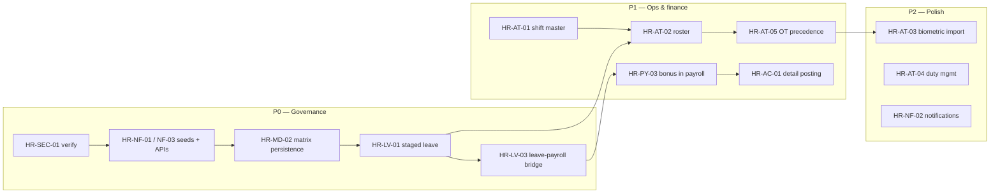

# HMS HR Module — Requirements & Gap Analysis Document

**Version:** 2.0  
**Source draft:** `requirements/Module-HR/hms-hr.txt`  
**Baseline system:** EasyOps ERP — `easyops-erp/services/hr-service`, `easyops-erp/frontend/src/pages/hr/*`, `easyops-erp/frontend/src/services/hrService.ts`, `easyops-erp/database-versioning/changelog/data/011-rbac-module-permissions.sql`  
**Revision notes (v2.0):** Deep pass over entities, payroll calculation path, attendance rollup semantics, compensation APIs, dormant persistence (`ShiftSchedule`), RBAC on self-service endpoints, department controller security, and HR ↔ organization-service boundaries.

---

## Executive summary

EasyOps ERP already implements a **large subset** of the HMS HR draft: organization-linked departments, positions (“designations”), employee master data, attendance CRUD and payroll time policy, weekly timesheets with approval states that affect payroll, leave types/balances/requests with simple approve/reject, sophisticated salary structures and payroll runs (including OT/LOP from attendance, loans, statutory PF/tax hooks), bonus/reimbursement entities, loan subsystem with reporting and accounting exports, PF/EPF lifecycle, and accounting journal posting for payroll summaries and EPF.

The deepest gaps versus the hospital narrative are: **no wired shift/roster product surface** (despite partial DB readiness), **no biometric import**, **no department approval matrix or multi-stage leave**, **no automated bridge from approved leave requests to payroll attendance classification**, **bonuses not rolled into payroll calculation**, **employee-facing APIs incorrectly gated** (`hr.manage` for leave submit; `hr.view` for payslip/salary self-service — both intended for HR roles per RBAC seeds), and **one unsecured department create endpoint** in hr-service. Addressing P0 governance and RBAC issues should precede roster/device work where pilot hospitals require compliant approvals day one.

---

## Methodology

| Activity | What was reviewed |
|----------|-------------------|
| Draft alignment | All sections of `hms-hr.txt` (purpose, master data, attendance/shift, leave/holiday, payroll, accounting flow, reports, approval matrix spec). |
| Backend | Controllers under `hr-service/.../controller`, core services (`PayrollCalculationService`, `PayrollAttendanceRollupService`, `LeaveService`, `AccountingFinanceIntegrationService`, `DepartmentIntegrationService`), entities (`Employee`, `AttendanceRecord`, `LeaveRequest`, `ShiftSchedule`, `Holiday`, `Bonus`, `PayrollRun`, …), `HrRbacService`. |
| Frontend | HR routes in `App.tsx`, representative pages (`LeaveRequestForm`, `DepartmentManagement`, payroll/salary managers), `hrService.ts` URL inventory. |
| RBAC | `011-rbac-module-permissions.sql`, loan-related HR permissions in `014-hr-loans-rbac-permissions.sql`. |

---

## 1. Business Overview

### 1.1 Brief description of the HR process or business need

The draft defines an end-to-end **Human Resources** capability for a hospital context: maintain organizational and employee master data; plan shifts and rosters; capture attendance (including device import and exceptions); manage duties and overtime; handle leave with approvals; run monthly payroll with salary components, loans, bonuses, and statutory-style deductions; post financial impacts to accounting; and produce audit-ready reports and notifications.

### 1.2 Purpose of the requested change

Align EasyOps ERP’s HR module with the **HMS HR draft** so that:

- Operational workflows match hospital expectations (multi-step leave approval, department approval matrices, roster-driven attendance rules).
- Payroll and accounting reflect salary expense, liabilities, loans, leave deductions, and overtime consistently with policy.
- Employees and managers can perform appropriate self-service and approval actions under **role-based access**, without relying on HR-admin-only workarounds or over-broad `HR_VIEW` grants.

---

## 2. Existing System / Current Implementation

### 2.1 Platform boundaries

- **Departments** are **owned by organization-service** (`DepartmentIntegrationService` calls `/api/organizations/{organizationId}/departments/**`). HR persists a sync snapshot via `DepartmentSyncService` but authoritative create/update/delete goes through organization APIs.
- **HR service** owns employees, attendance, timesheets, leave, payroll, salary structures, loans (domain), PF/EPF, bonuses/reimbursements (via compensation), and integration orchestration.

### 2.2 Component inventory (evidence-based)

| Draft area | Implemented artifact | Detail |
|------------|---------------------|--------|
| **Department info** | `DepartmentController` + `DepartmentIntegrationService` | List/get/create/update/delete; DTO includes `code`, `managerId` (department head), parent hierarchy. UI: `DepartmentManagement.tsx`. |
| **Designation** | `Position` entity, `PositionController`, `PositionManagement.tsx` | Title, `departmentId`, string `level`, salary range, currency, default structure/grade/band IDs. |
| **Employee registration** | `Employee` entity, `EmployeeController` | `employeeNumber`, name, DOB, contact, address, emergency contact, `departmentId`, `positionId`, `managerId`, `hireDate`, `terminationDate`, `employmentStatus`, `employmentType`, `userId`, `isActive`. **No** bank account fields on `Employee`. |
| **Shift info** | `ShiftSchedule` entity + `ShiftScheduleRepository` only | Table `hr.shift_schedules` holds `employee_id`, `shift_date`, `shift_name`, `start_time`, `end_time`, `break_duration`, `is_overtime`, `notes`. **No controller, no service usage, no frontend** — persistence is **dormant**. |
| **Employee roster** | — | Not implemented as a product (no API/UI). **Do not conflate** with `hospital-scheduling-service` (clinical appointments/resources). |
| **Attendance** | `AttendanceController`, `AttendanceRecord` | Per-day unique `(employee_id, attendance_date)`; clock in/out; break times; `regularHours`, `overtimeHours`; `status`; notes; `approvedBy`/`approvedAt`; full CRUD under `hr.manage`. |
| **Timesheets** | `TimesheetController`, `Timesheet` / `TimesheetLine` | Weekly bucket; `draft` → submit; statuses **SUBMITTED**, **APPROVED**, **PROCESSED** count toward payroll OT rollup (`PayrollAttendanceRollupService`). Single `approvedBy`. |
| **Duty / overtime settings** | Partial | OT rate multiplier and standard hours are **org-wide** in `PayrollTimeAttendancePolicy` (API under `PayrollController`: `/payroll/time-attendance-policy`). Optional salary components `OT_PAY` (earning) and `LOP_DED` (deduction) created by `SalaryService.ensureAttendancePayrollLineComponents`. No per-shift/category rate table. |
| **Leave** | `LeaveController`, `LeaveService` | Leave types (seeded per org), balances per year, requests with `pending` → `approved`/`rejected`, single `approvedBy`. **Approve deducts balance immediately on approval** — no partial/staged deduction. |
| **Holiday** | `Holiday` entity, `HolidayRepository` | Used by **loan** installment date adjustment (`EmployeeLoanService`), not exposed for HR calendar administration. |
| **Payroll** | `PayrollController`, `PayrollCalculationService`, `PayrollService` | Runs in **DRAFT** → populate from salary → process → approve; `PayrollDetail`, `PayrollComponent` lines; payslip `GET /payroll/runs/{runId}/payslip`; accounting export `GET .../accounting-export`; post `POST .../post-to-accounting`; EPF hooks `process-epf`, `post-epf-to-accounting`. |
| **Salary / increments** | `SalaryController`, large surface | Structures, grades, bands, components (formula/amount), employee assignments & details, revision history, bulk revisions with approve/reject, bulk component import/export, component cost reports, **employee salary revision history** API (`/salary/employee/{id}/revision-history`). |
| **Loans & advances** | `/api/hr/loans/**` | Applications workflow, accounts, installments, payroll recoveries, org audit, accounting export endpoints; self-service read paths under `/loans/self/**`. |
| **Bonus & incentives** | `CompensationController` (`/api/hr/compensation/bonuses`), `Bonus` entity | Bonus CRUD/approve pattern analogous to reimbursements. **Not referenced** from `PayrollCalculationService` (bonuses do **not** auto-flow into payroll run totals). |
| **Accounting integration** | `AccountingFinanceIntegrationService` | Payroll: summary journal (`6110` expense, `2020` deductions liability, `1030` bank net) from `PayrollAccountingExportDto`; EPF journal (`EPF_PAYABLE` / `CASH`). Export DTO supports **detail lines** for richer posting (`INT-19`–`INT-23` in code comments). |
| **Provident Fund / EPF** | Multiple controllers | Full parallel track (accounts, contributions, withdrawals, filings, remittances, audit events, org policy page). Beyond short HMS draft but **production-weight** in codebase. |
| **Dashboard / analytics** | `HrDashboardController`, `AdvancedAnalyticsController`, PF reporting | Headcount, recent hires, stats; scheduled/custom reports; PF executive dashboards. |

### 2.3 Payroll calculation pipeline (how pay is actually computed)

For each employee in period (active, hired before period end, not terminated before period start):

1. Resolve **active salary assignment** and **component detail rows** as of period end; order components by dependency.
2. Skip explicit **loan repayment** category lines — amount injected via `LoanPayrollRecoveryService`.
3. Merge **attendance rollup**: `PayrollAttendanceRollupService.rollupForPayPeriod` loads **attendance records** + **approved/submitted timesheets** in range.
4. Classify each attendance row `status` string into: present, half-day, **paid leave**, **LOP**, or ignore (`PayrollAttendanceRollupService.classifyAttendanceStatus`). Recognized paid-leave tokens include e.g. `paid_leave`, `on_leave`, `annual_leave`, … — **this is independent of `LeaveRequest` approval**.
5. Optionally infer **missing weekdays as LOP** when `infer_missing_weekday_lop` is true (weekends excluded).
6. **Overtime hours**: prefer sum from attendance rows; else from qualifying timesheets.
7. Compute **OT amount** from basic salary × working days × OT hours × `(standard_hours_per_day, overtime_rate_multiplier)`; compute **LOP** money from basic × LOP days / working days.
8. Append optional lines for component codes **`OT_PAY`** and **`LOP_DED`** when amounts &gt; 0.
9. Run statutory PF engine and other deferred statutory lines; persist `PayrollDetail` + components.

**Implication for draft §4.3 (“automatic leave deduction”)**: Paid vs unpaid leave in payroll is driven by **attendance status conventions** and **LOP inference**, not by the leave module’s approved requests — unless operations manually align attendance or a future integration writes attendance from leave.

### 2.4 Leave module mechanics (current behavior)

- Creating a request sets `status = pending` (`LeaveService.createLeaveRequest`).
- **Approval** sets approved, stamps single approver, **immediately increments `usedDays`** on current year balance (`updateLeaveBalance`).
- **Rejection** stores rejector in `approvedBy` field (same column as approval — semantic overload).
- API **`POST /api/hr/leave/requests`** calls `hrRbac.requireHrManage` — only users with **`hr.manage`** can create requests (employees with only “employee” roles typically **cannot** submit via API despite UI).
- Approve/reject endpoints also require **`hr.manage`** — line managers without HR manage cannot approve in-product.

### 2.5 RBAC and API security observations

`HrRbacService` maps:

- **View:** `hr` + `view` **or** `hr` + `manage`.
- **Manage:** `hr` + `manage` only.

Database seeds (`HR_VIEW`, `HR_MANAGE`) describe HR dashboards and configuration — **not** “any authenticated employee.”

**Self-service endpoints still require HR_VIEW:**

- `GET /api/hr/salary/self/summary` → `requireHrView`.
- `GET /api/hr/payroll/self/payslips` → `requireHrView`.

So an employee who must **not** see company-wide HR data should not be granted `HR_VIEW`; today that **blocks** own payslip/salary summary unless gateway impersonation or separate permission model is introduced.

**Critical:** `POST /api/hr/departments` (**create**) accepts **no** `X-User-Id` header and performs **no** `hrRbac.requireHrManage` check in `DepartmentController`, unlike PUT/DELETE. Gateway must enforce authentication/authorization or this is an **authorization hole** for department creation.

Loan module adds finer permissions (`hr_loans/*`) — pattern exists for splitting HR domain RBAC; core HR still coarse.

### 2.6 Limitations, gaps, or issues vs. the HMS draft (consolidated)

1. **Shift master / roster UX**: No operational shift catalog or monthly roster planner; **`ShiftSchedule` is unused** outside JPA repository.
2. **Duty management**: No first-class duty swap/replacement module (timesheets are closest parallel).
3. **OT configuration**: Org-wide multiplier only; draft expects shift/category rates.
4. **Biometric import**: No bulk/device ingest endpoint or reconciliation workflow on attendance.
5. **Grace / lateness**: Not modeled; lateness not distinguished from present in rollup classification.
6. **Leave governance**: Single-step approval; no in-charge vs management; no approval matrix; manager approve APIs require HR manage.
7. **Holiday administration**: No REST/UI; no department-scoped or employee-specific holiday calendars in API layer.
8. **Leave ↔ payroll**: Approved leave does **not** automatically drive paid-leave vs LOP payroll logic.
9. **Employee self-service RBAC**: Leave submit and payslip/salary self-service conflict with least-privilege HR permissions (see §2.5).
10. **Bank details**: Not on `Employee`; payroll `PayrollDetail` has `paymentMethod` default `bank_transfer` without persisted bank account proof in HR employee record (may live elsewhere — not verified in HR scope).
11. **Bonus ↔ payroll**: Bonus records **not** integrated into payroll population/calculation.
12. **Department create authorization**: Missing RBAC on `POST /departments` in hr-service controller.
13. **Notifications**: HR does not emit standardized attendance/payroll events to `communication-service` in reviewed paths (draft optional).
14. **Reports**: Many exports exist (salary bulk export, loan registers, PF dashboards); draft §8 naming not uniformly reflected as “hospital report pack.”

---

## 3. New Requirements / Enhancements

Traceability IDs retained from v1; sub-requirements added where deep analysis exposed missing specificity.

### 3.1 Master data / configure

| ID | Requirement | Expected workflow / behavior | Deep-dive notes |
|----|-------------|------------------------------|-----------------|
| **HR-MD-01** | Department: name, **code**, head, mapping | Enforce **unique code** per org at organization-service contract + HR UI validation; head = `managerId` or explicit role. | Confirm uniqueness rules with organization-service API; sync snapshot must reflect code for reporting. |
| **HR-MD-02** | Approval matrix (draft §9) | Per department: `approvers_count ≥ 1`, ordered active employee IDs, no duplicates; dynamic UI fields. | Persist either in HR schema or organization-service extension; HR leave engine consumes matrix. |
| **HR-MD-03** | Designation hierarchy | Add **numeric** `hierarchyRank` (or parse `level`) for sorting and “who approves whom” rules. | Avoid overloading free-text `level`. |
| **HR-MD-04** | Employee completeness | Bank fields (bank name, branch, account number, routing/IBAN per locale), validated encrypted-at-rest policy; employment statuses align with draft Active/Inactive/Resigned. | `employeeNumber` uniqueness already enforced by lookup API patterns. |

### 3.2 Attendance & shift management

| ID | Requirement | Expected workflow / behavior | Deep-dive notes |
|----|-------------|------------------------------|-----------------|
| **HR-AT-01** | Shift master | CRUD shift definitions (type: night/day/rotational, grace minutes, expected hours). | Consider **normalizing** dormant `ShiftSchedule` toward FK to `ShiftDefinition` + published roster version. |
| **HR-AT-02** | Roster | Monthly planner by dept/individual; overlay holidays + approved leave. | **Wire** persistence; optional migrate legacy `shift_schedules` rows if any environments already seeded. |
| **HR-AT-03** | Attendance import & adjustments | Vendor file/API → staging → apply to `AttendanceRecord`; correction workflow with reason + approver. | Idempotent keys per device punch `(employee, timestamp, source_id)`. |
| **HR-AT-04** | Duty management | Assign/swap duties; audit. | Could extend timesheet lines with “duty code” or new entity linked to roster. |
| **HR-AT-05** | OT rates | Resolve multiplier by shift band / employee category → OT_PAY calculation. | Replace single global multiplier default path or layer precedence: employee → shift → org policy. |

### 3.3 Leave & holiday management

| ID | Requirement | Expected workflow / behavior | Deep-dive notes |
|----|-------------|------------------------------|-----------------|
| **HR-LV-01** | Staged leave | submit → verify → approve per matrix; balances update **once** on final approval (or accrue encashment rules per policy). | **Change** current “approve immediately deducts balance” if intermediate rejection must restore nothing consumed. |
| **HR-LV-02** | Holidays | CRUD + optional `department_id` / `employee_id` scope on `Holiday` or child tables. | Expose repository; integrate rollup to exclude org holidays from LOP inference when configured. |
| **HR-LV-03** | Leave deduction rules | Policy engine: bridge **approved leave dates** → attendance **paid_leave** synthetic rows OR payroll exclusion from LOP; unpaid leave → LOP. | Eliminates manual dual entry. |

### 3.4 Payroll & salary management

| ID | Requirement | Expected workflow / behavior | Deep-dive notes |
|----|-------------|------------------------------|-----------------|
| **HR-PY-01** | Pay register / increments | Standard report naming; leverage existing revision history + payroll runs export. | Already strong API coverage — packaging/UI parity only. |
| **HR-PY-02** | Loans | Continue payroll recovery; align journal narration with finance COA. | Loan accounting exports exist — cross-check double-entry with payroll posting. |
| **HR-PY-03** | Bonus registers ↔ payroll | Approved bonuses for period **included** in populate-from-salary or pre-step allocation; optional `payroll_run_id` on `Bonus`. | **Net-new** calculation linkage identified in v2 analysis. |
| **HR-PY-04** | Payslips | Reflect staged leave, roster-based OT, corrected attendance source. | Payslip DTO already component-ordered (`PayrollCalculationService.getPayslip`). |

### 3.5 Integration & accounting

| ID | Requirement | Expected workflow / behavior | Deep-dive notes |
|----|-------------|------------------------------|-----------------|
| **HR-AC-01** | Hospital COA mapping | Use `PayrollAccountingExportDto.detailLines` + component account codes (`PayrollAccountingLineDto` expense/liability overrides per INT-20) instead of summary-only `6110/2020/1030` where needed. | Bonus/loan/Benefits postings may need separate journal types. |

### 3.6 Cross-cutting

| ID | Requirement | Notes |
|----|-------------|-------|
| **HR-NF-01** | Self-service | New permissions: `hr.self.leave.submit`, `hr.self.payslip.view`, `hr.self.salary.summary.view` **OR** enforce resource-scoped checks (actor `userId` matches `Employee.userId` + org) without granting `HR_VIEW`. |
| **HR-NF-02** | Notifications | Event hooks: leave transition, payroll approved, attendance anomaly; publish to `communication-service`. |
| **HR-NF-03** | Manager approve | `leave.approve.stage{N}` scoped by matrix or reporting line without full `HR_MANAGE`. |
| **HR-SEC-01** | **Secure department create** | Add `X-User-Id` + `requireHrManage` to `POST /api/hr/departments` (or deprecate proxy-only pattern with explicit service account). |

**Approval matrix validations (draft §9):** unchanged — department ID read-only; name unique; approver count ≥ 1; active employees; distinct IDs; sequence defines hierarchy.

---

## 4. Gap Analysis

### 4.1 Traceability matrix (draft § → implementation)

| Draft § | Topic | Implementation status |
|---------|-------|----------------------|
| §2.1 | Department + matrix | Dept **partial** (no matrix); mapping employees via `Employee.departmentId`. |
| §2.2 | Designation | **Position** ≈ designation; hierarchy weakly modeled (`level` string). |
| §2.3 | Employee registration | **Strong** except bank details. |
| §3.1–3.2 | Shift / roster | **Dormant DB (`ShiftSchedule`)** + **no product**. |
| §3.3 | Attendance import/adjust/grace | Manual/API CRUD only; **no** grace engine. |
| §3.4 | Duty replace | **Gap** (timesheets adjacent only). |
| §3.5 | OT settings | Org policy + attendance hours → **partial** (no category rates). |
| §4.1 | Leave workflow | **Gap** (single approver + RBAC issues). |
| §4.2 | Holidays | Entity **only for loans**; admin **gap**. |
| §4.3 | Leave deduction | Payroll uses **attendance status**, not leave requests — **integration gap**. |
| §5.x | Payroll / loans / bonus | Payroll + loans **strong**; bonus **not in payroll engine**. |
| §6 | Accounting | **Partial** (summary payroll + EPF); detail posting optional via export. |
| §8 | Reports | **Partial** — many ERP reports; not HMS-named pack. |
| §9 | Approval matrix | **Gap**. |

### 4.2 Missing functionalities (new development)

(See §4.1; priorities unchanged conceptually — add **HR-PY-03 bonus linkage**, **HR-LV-03 leave-payroll bridge**, **HR-SEC-01**, **permission model** for self-service.)

### 4.3 Required modifications (enhance existing features)

| Area | Change |
|------|--------|
| **LeaveController** | Resource-scoped create + staged approve; split RBAC from blanket `hr.manage`. |
| **LeaveRequest** | Model multi-step approvals (`leave_approval_step` or status machine `PENDING_VERIFICATION`, etc.). |
| **PayrollCalculationService** | Optional feed from approved leave + bonus lines; holiday-aware working-day denominator. |
| **DepartmentController** | Authenticate/authorize **POST** create. |
| **Salary/Payroll self endpoints** | Replace blanket `requireHrView` with self-scope check **or** new RBAC seeds. |
| **ShiftSchedule** | Either adopt via service layer + API or deprecate in favor of normalized shift/roster schema. |

### 4.4 Features that can be reused

- Full **salary structure** engine, **bulk revision**, **revision history** APIs (increment history reporting).
- **Payroll run** lifecycle, **payslip**, **accounting export DTO** with detail lines.
- **Attendance rollup** classification mechanism (extend tokens + integrate leave).
- **Loan** subsystem depth (audit, payroll recovery, accounting exports).
- **communication-service** for outbound SMS/email when events exist.

### 4.5 Impacted modules / screens / APIs / reports

Expanded list: `LeaveController`, `SalaryController` (self paths), `PayrollController`, `DepartmentController`, `AttendanceController`, new shift/roster controllers, `database-versioning` RBAC seeds, `frontend` routes/menu permissions, **organization-service** if matrix stored canonically, **accounting-service** COA documentation.

### 4.6 Business justification by theme

(Unchanged intent — add **bonus accuracy** and **audit integrity** for RBAC/security fixes.)

---

## 5. Functional Requirements

### 5.1 User stories (expanded)

1. **HR Admin** maintains departments (via HR UI calling organization-service) with validated codes and assigns department head; configures approval matrix; **cannot** create departments without authenticated HR manage (**HR-SEC-01**).
2. **HR Planner** publishes monthly roster; calendar displays approved leave and institutional holidays.
3. **Integration operator** uploads biometric punch file; system returns error report; applying commits attendance rows idempotently.
4. **Employee** submits leave from self-service; **Verifier** at matrix level 1 acts; **Approver** at final level completes; notifications fire on each transition when enabled.
5. **Payroll officer** runs populate; system applies bonuses marked for period, loan recoveries, OT/LOP per policies, PF/statutory lines; finance posts detail or summary journals.

### 5.2 Role-based access requirements

| Role | Must | Must not |
|------|------|----------|
| Employee | Submit **own** leave; view **own** payslips/salary summary | See unrelated employee PII without HR_VIEW scope |
| Matrix approver | Act only on requests where actor is next step approver | Approve outside department matrix |
| HR Operations | Master data, attendance fixes, payroll preparation | Post accounting journals unless dual-role finance |
| Finance | Trigger accounting post, reconcile exports | Edit clinical scheduling |

### 5.3 UI/UX expectations

- Matrix form **exactly** mirrors draft §9 dynamic fields.
- Roster: conflict highlighting (double booking, leave overlap).
- Payroll populate preview: warnings for employees missing attendance linkage where leave bridge expected.

---

## 6. Non-Functional Requirements

| Area | Expectation |
|------|-------------|
| **Performance** | Bulk attendance import **≥ 10k rows** &lt; **N minutes** on reference hardware (define N with ops); payroll populate remains batch-safe (existing patterns). |
| **Security** | Fix department POST RBAC; encrypt bank fields; audit approval overrides; correlation IDs on finance posts (`IntegrationCorrelationIdHolder` pattern extended). |
| **Compliance** | Immutable payroll lines after lock; approval history retained; align with hospital retention policy. |
| **Reliability** | Idempotent device punch ingestion; replay-safe accounting posts (`idempotencyKey` on `PayrollAccountingExportDto`). |

---

## 7. Reports and Notifications

### 7.1 Draft §8 mapping (refined)

| Report | Baseline capability |
|--------|---------------------|
| Employee list / status | `EmployeeList` + filters (`status`, `departmentId`, search API). |
| Monthly attendance | Attendance queries — add export + shift/roster columns **after** roster exists. |
| Shift & roster | **New** once roster live. |
| Leave summary / balance | Balances API + org-wide aggregation report **to add**. |
| Payroll / pay register | Payroll run details + accounting export + salary bulk export **near fit**. |
| Loan ledger | Loan register/accounting exports **strong**. |
| Bonus register | List via compensation API — add **payroll reconciliation** column when HR-PY-03 done. |
| Increment / salary history | `revision-history` endpoints — surface as standard HMS report. |

### 7.2 Notifications

Define event catalog (`leave.submitted`, `leave.approved_final`, `payroll.run.approved`, `attendance.anomaly`) with template IDs per org — integrate via existing communication patterns.

---

## 8. Acceptance Criteria

Additions to v1:

- **AC-09**: `POST /api/hr/departments` rejects unauthenticated or unauthorized callers per policy.
- **AC-10**: User with **only** employee role (no `HR_VIEW`) retrieves **own** payslip list successfully via self endpoint after RBAC fix.
- **AC-11**: Approved paid leave spanning weekdays **does not** generate LOP for those days when leave-payroll bridge enabled.
- **AC-12**: Approved bonus with `pay_period = March 2026` appears in March payroll run gross (once HR-PY-03 implemented).

**Regression tests**

- **TS-05**: Payroll populate with zero attendance rows and `infer_missing_weekday_lop=true` still behaves as today (document baseline before changing defaults).
- **TS-06**: Leave rejection does not corrupt balance if staged workflow rolls back partial state.

---

## 9. Dependencies and Assumptions

### 9.1 External systems / teams

- **organization-service**: department schema ownership; potential home for approval matrix if centralized org structure prefers it.
- **accounting-service**: COA existence for summary and detail postings.
- **communication-service**: templates and provider config (e.g. SMS provider already in stack).
- **Biometric vendor**: contract + data dictionary.

### 9.2 Assumptions

- `Employee.userId` linkage reliable for self-service scoping.
- PF/EPF remains mandatory parallel track for deployments that require it.
- Clinical scheduling stays separate unless product explicitly merges HR duty roster with clinical shifts.

---

## 10. Priority and Timeline

| Priority | Scope | Rationale |
|----------|-------|-----------|
| **P0** | HR-SEC-01, employee/manager RBAC split (HR-NF-01/03), staged leave MVP + matrix (HR-MD-02, HR-LV-01) | Security + governance blockers for hospital adoption. |
| **P0** | HR-LV-03 leave ↔ payroll bridge (minimal: paid leave prevents LOP for overlapping dates) | Eliminates payroll/leave mismatch disputes. |
| **P1** | Shift master + roster MVP (HR-AT-01/02), wire or replace `ShiftSchedule` | Operational scheduling. |
| **P1** | HR-PY-03 bonus inclusion; HR-AC-01 detail posting adoption | Financial completeness. |
| **P2** | Device import (HR-AT-03), duty board (HR-AT-04), grace rules, notifications | Operational polish. |

**Indicative phases**

| Phase | Focus | Weeks (indicative) |
|-------|-------|-------------------|
| **A** | Security + RBAC + leave workflow MVP | 3–5 |
| **B** | Leave-payroll bridge + holiday admin API/UI | 3–4 |
| **C** | Shift/roster + OT precedence rules | 6–10 |
| **D** | Device ingest + notifications + reporting pack | 4–8 |

---

## 11. Implementation Plan

This section turns §10 priorities and §3 traceability IDs into a sequenced delivery plan. **Baseline:** some security and self-service items called out in §2.5 were addressed per **Document control → Code alignment (2026)** — treat those as **verify / harden** tasks before expanding scope.

### 11.1 Guiding principles

1. **Governance before roster/devices:** Fix authorization, least-privilege self-service, and leave approval paths before large attendance-ingest or shift UX work where pilots require compliant workflows on day one.
2. **Single source of truth:** Decide once where the approval matrix lives (HR schema vs organization-service extension) and document sync if split.
3. **Incremental payroll integration:** Land **HR-LV-03** with a narrow behavior (paid approved leave suppresses LOP for overlapping dates) before broader policy engines or bonus linkage complexity.
4. **Canonical roster model:** Resolve `ShiftSchedule` vs normalized shift/roster schema in an architecture decision **before** parallel implementations (see Appendix C).

### 11.2 Dependency overview

### 11.3 Phase A — Security, RBAC, leave governance MVP (aligns with Phase A in §10)

| Track | Deliverables | Requirement IDs | Acceptance / verification |
|-------|----------------|-----------------|---------------------------|
| **A1 — Secure APIs** | Confirm `POST /api/hr/departments` requires authenticated caller + `hr.manage` (or gateway-equivalent); audit other proxy endpoints for parity. | HR-SEC-01 | AC-09 |
| **A2 — Self-service permissions** | Granular RBAC seeds (`hr.self.*` / `leave.self.*` as named in Document control) + replace blanket `requireHrView` on salary/payslip self paths where still applicable; ensure leave submit/list/read scopes to linked `Employee.userId`. | HR-NF-01 | AC-10 |
| **A3 — Manager / matrix approver** | APIs for approve/reject that do **not** require full `HR_MANAGE` when actor is next matrix step or direct manager (consistent with staged model). | HR-NF-03 | §5.2 Matrix approver row |
| **A4 — Approval matrix** | Persist matrix per department; validation per draft §9; HR UI dynamic fields; read model for leave engine. | HR-MD-02 | Matrix form acceptance §5.3 |
| **A5 — Staged leave** | State machine (e.g. pending verification → pending final → approved/rejected); balance deduct **once** on final approval; fix semantic overload of `approvedBy` for rejection if needed; rejection restores no interim consumption. | HR-LV-01 | TS-06 |

**Exit criteria:** Employees can submit leave and view own payslip/summary without `HR_VIEW`; department create cannot be abused; staged leave + matrix usable end-to-end in UI and API.

### 11.4 Phase B — Leave ↔ payroll bridge and calendar (aligns with Phase B in §10)

| Track | Deliverables | Requirement IDs | Acceptance / verification |
|-------|----------------|-----------------|---------------------------|
| **B1 — Leave-payroll bridge** | On payroll populate/rollup, merge approved paid-leave date ranges so overlapping weekdays are **not** counted as LOP when bridge enabled; unpaid leave → LOP per policy flag. | HR-LV-03 | AC-11 |
| **B2 — Holiday administration** | REST + UI for `Holiday`; optional department/employee scope; integrate with LOP inference (exclude org holidays when configured). | HR-LV-02 | TS-05 regression documented |
| **B3 — Payroll calculation touches** | `PayrollCalculationService` / rollup: feature flag for bridge; holiday-aware working-day denominator where specified in policy. | HR-LV-03, HR-LV-02 | TS-05 |

**Exit criteria:** AC-11 satisfied in integration tests; no regression on baseline LOP inference when bridge disabled.

### 11.5 Phase C — Shift master, roster, OT precedence (aligns with Phase C in §10)

| Track | Deliverables | Requirement IDs | Notes |
|-------|----------------|-----------------|-------|
| **C1 — Shift definitions** | CRUD shift master (type, grace minutes, expected hours); migration path from dormant `ShiftSchedule` if retained. | HR-AT-01 | Normalize FK vs replace table — ADR |
| **C2 — Roster** | Monthly planner by dept/individual; overlay holidays + approved leave; conflict UX §5.3. | HR-AT-02 | Wire persistence |
| **C3 — OT rules** | Precedence: employee category → shift band → org `PayrollTimeAttendancePolicy`; feed `OT_PAY` calculation. | HR-AT-05 | Backward compatible default |
| **C4 — Master data polish** | `Position`: numeric `hierarchyRank` (HR-MD-03); employee bank fields with encryption policy (HR-MD-04). | HR-MD-03, HR-MD-04 | Coordinate with security review |

**Exit criteria:** Roster drives expected shift context where applicable; payslip narrative can reflect roster-based OT when HR-PY-04 documentation requires it.

### 11.6 Phase D — Bonuses, accounting depth, ingest, notifications (spans P1 closure + P2)

| Track | Deliverables | Requirement IDs | Acceptance / verification |
|-------|----------------|-----------------|---------------------------|
| **D1 — Bonus ↔ payroll** | Approved bonuses for pay period included in populate/calculation; optional `payroll_run_id` on `Bonus`; reconciliation column in bonus register report. | HR-PY-03 | AC-12 |
| **D2 — Accounting** | Adopt `PayrollAccountingExportDto.detailLines` / component overrides where hospital COA demands (coordinate accounting-service). | HR-AC-01 | Finance sign-off |
| **D3 — Biometric import** | Staging → validate → idempotent apply to `AttendanceRecord`; correction workflow with reason + approver. | HR-AT-03 | NFR bulk performance §6 |
| **D4 — Duty management** | Assign/swap duties with audit (extend timesheet lines or new entity). | HR-AT-04 | — |
| **D5 — Grace / lateness** | Optional lateness classification extending rollup (links HR-AT-01 grace minutes). | §2.6 item 5 | Define tokens with payroll |
| **D6 — Notifications** | Event catalog §7.2 → `communication-service` (leave transitions, payroll approved, attendance anomalies). | HR-NF-02 | Template IDs per org |
| **D7 — Reports pack** | HMS-named exports where marketing requires; leverage existing payroll/salary/loan/PF APIs §7.1. | §7.1 | UI packaging |

### 11.7 Cross-cutting engineering checklist

| Area | Actions |
|------|---------|
| **database-versioning** | Liquibase changelogs for matrix tables, leave approval steps, bonus `payroll_run_id`, shift/roster entities, holiday scope columns. |
| **RBAC seeds** | New permissions in `011-rbac-module-permissions.sql` (or successor); gateway route guards aligned with hr-service. |
| **hr-service** | Controllers/services per §4.3; integration tests for AC-09–AC-12, TS-05–TS-06. |
| **frontend** | `App.tsx` routes/menu; matrix UI; roster planner; attendance import UI; bonus reconciliation columns. |
| **organization-service** | Only if matrix or department extensions stored canonically — contract tests with HR. |

### 11.8 Milestones and sequencing summary

| Milestone | Completion definition |
|-----------|-------------------------|
| **M1 — Safe HR API surface** | A1–A3 done; penetration/regression on department + self endpoints. |
| **M2 — Governed leave** | A4–A5 done; matrix + staged workflow in UAT. |
| **M3 — Payroll truth** | B1–B3 done; AC-11 green. |
| **M4 — Scheduling core** | C1–C3 done; roster MVP in pilot dept. |
| **M5 — Payroll completeness** | D1–D2 done; AC-12 green. |
| **M6 — Operational scale** | D3–D7 prioritized per hospital rollout. |

### 11.9 Risks and checkpoints

- **Parallel roster implementations:** Gate C1 on Appendix C decision (single canonical roster model).
- **organization-service coupling:** If matrix lives in org-service, add milestone **M0 — API contract agreed** before A4 development completes.
- **Payroll regressions:** Maintain TS-05 baseline tests whenever rollup/classification logic changes.

---

## Appendix A — Representative REST surface (`hr-service`)

Not exhaustive; illustrates breadth for integration planning.

| Prefix | Concern |
|--------|---------|
| `/api/hr/employees` | Employee CRUD, filters |
| `/api/hr/departments` | Proxy CRUD to organization-service (**POST:** hr-service enforces `hr.manage` per HR-SEC-01 — confirm gateway parity §11.3 A1) |
| `/api/hr/positions` | Positions |
| `/api/hr/attendance` | Attendance CRUD + clock |
| `/api/hr/timesheets` | Timesheets + submit/approve |
| `/api/hr/leave` | Types, requests, balances |
| `/api/hr/payroll` | Runs, populate, process, approve, payslip, accounting export/post, time-attendance policy, self payslips |
| `/api/hr/salary` | Structures, components, assignments, exports, **self summary**, bulk revisions |
| `/api/hr/compensation` | Reimbursements, bonuses |
| `/api/hr/loans/**` | Loans domain |
| `/api/hr/provident-fund/**`, `/api/hr/epf/**` | PF/EPF |
| `/api/hr/integration/**` | Payroll completion, sync, EPF post helpers |

---

## Appendix B — Key persistence artifacts vs draft

| Table / entity | Draft alignment |
|----------------|-----------------|
| `hr.employees` | Core HR master |
| `hr.attendance_records` | Daily attendance |
| `hr.shift_schedules` | Schema-only roster hint — **unwired** |
| `hr.timesheets` | Weekly effort — payroll OT fallback |
| `hr.leave_*` | Leave domain |
| `hr.holidays` | Loan scheduling helper — **not HR calendar** |
| `hr.payroll_*`, salary tables | Payroll engine |
| `hr.bonuses` | Compensation — **not payroll-integrated** |

---

## Appendix C — Risks and open questions

| Risk | Mitigation |
|------|------------|
| Granting `HR_VIEW` to all employees for payslip access exposes broader HR APIs | **Partially addressed:** own payslip/salary summary APIs allow linked employee without `HR_VIEW`; other HR list endpoints unchanged — keep least-privilege roles. |
| Dual entry (leave approved but attendance LOP) causes payroll errors | Prioritize HR-LV-03 bridge. |
| `ShiftSchedule` drift if teams build parallel roster tables | Single canonical roster model decision in architecture review. |
| Organization-service owns departments while matrix might need HR-local caching | Define source of truth and sync strategy. |

---

## Document control

| Item | Detail |
|------|--------|
| **v1.0** | Initial gap analysis from draft vs HR module. |
| **v2.0** | Payroll pipeline semantics, dormant `ShiftSchedule`, bonus isolation, RBAC/self-service conflict, unsecured department POST, traceability matrix, expanded acceptance criteria and appendices. |
| **Code alignment (2026)** | **HR-SEC-01:** `POST /api/hr/departments` requires `X-User-Id` + `hr.manage`. **HR-NF-01 (partial):** `HrEmployeeSelfAccessService` — leave submit for linked employee; leave types/balances/list-own/read-own/manager-read; direct-manager approve/reject when `approvedBy`/`rejectedBy` matches manager employee id; payroll payslip + salary self-summary + my payslips allow linked employee without `HR_VIEW`. Fixed payslip/salary self bugs comparing user UUID to employee UUID. Leave list: `employeeId` + `status` no longer leaks org-wide pending queue. |
| **Next steps** | Execute **§11 Implementation Plan** (phases A→D, milestones M1–M6); remaining gaps: approval matrix DB + staged leave; leave ↔ payroll bridge (HR-LV-03); roster/API for `ShiftSchedule`; granular RBAC seeds (`leave.self.*`); bonus ↔ payroll (HR-PY-03); gateway verification for department POST where not delegated to gateway. |
